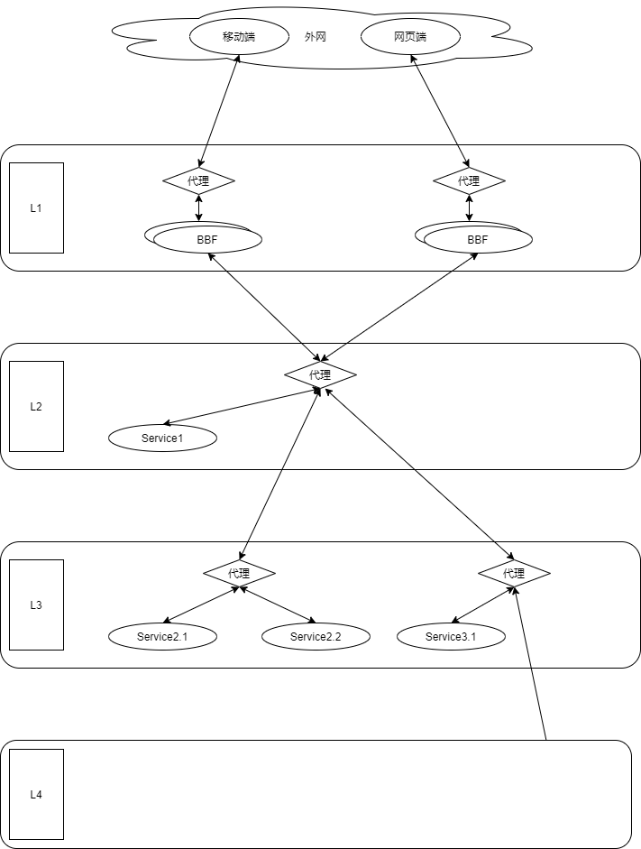

# 微服务架构

微服务架构是当今流行的一种应用构造形式,与之相对的概念是单体应用架构.在了解微服务架构之前我们先来明确几个概念.

## 概念定义

> 业务

指的是需要处理的事务(功能)的集合.比如github的业务就是提供代码托管及相关的功能.业务是有拓展性需求的,比如github开始只是托管代码加社交功能,后面又加上了项目管理功能,又加上了文档静态页面托管功能,又加上了cicd功能等,鬼知道后面还会有什么新功能.

> 领域

指的是实现特定业务功能需要的专业范围.比如cicd功能需要使用到沙盒,虚拟化等领域的知识

> 应用

解决业务全部需求的实现,比如github这个站就是他们公司业务对应的应用.

> 服务

应用需要业务功能或者领域技术的实现

> 接口

服务提供的交互入口

## 单体应用架构

要实现业务需求,最简单最自然的想法就是写个服务来实现全部功能,这就是单体应用了.

单体应用的特征是一个应用对应一个服务.因此结构最简单,使用的也最多.

单体应用的复杂性体现在服务内部,由于需要实现所有功能,在业务复杂功能需求很多的情况下往往不是一个人或者小团队开发而是一个大团队开发.
这就给开发,维护和后续扩展带来了更大的复杂性.单体应用面临的最大困境就是在于业务复杂的情况下项目管理的的复杂度随成员数量成指数级增长(复杂度只要来自沟通成本,论点来自于人月神话).

除了上面的点外单体应用还有2个缺点:

1. 单体应用对于功能复用也很不友好.要复用其中的某一功能或者领域技术的实现只能是代码级的复用(内部调用程序接口,外部复制代码).
2. 单体应用的鲁棒性不好,要挂就所有功能都挂.

但是大多数时候这些问题其实是不存在的,因为多数企业或者项目都成长不到这种复杂度就会走到生命的尽头...而它的优点--结构简单此时就足以让人选择这种架构了.

## 微服务应用架构

微服务应用架构其实也是在单体应用架构下很自然的一个发展.如果一个服务过于复杂我们可以将功能拆分后做成几个独立服务来降低单个服务的复杂度.这是一种分治思想的应用.它也确实可以解决单体应用面临的最大困境--由于团队过大造成的项目管理复杂度过大.

通过拆分功能,每个小团队甚至个人只需要实现几个功能,而功能间的相互调用则是走web接口.

我们知道复杂性不会消失只会转移,微服务的复杂性实际上只是从项目管理方面转移到了服务的拆分与集成和服务治理上.

那么是否真的值得呢?这就得看应用规模了.还是那句话,小应用简单应用犯不着上微服务,但一旦规模扩大到一定程度(个人经验是4个人维护吃力的程度)那就应该开始渐进的使用微服务架构.关键是要在拆分这件事情变得太过昂贵之前意识到你需要做这个拆分,否则你会付出惨痛代价.

### 服务的拆分与集成

第一块增加复杂度的地方就是服务组织,因为微服务实际上已经不是一个"软件"了而是一个"系统",就像单细胞生物演化为多细胞生物,服务之间天然的有了区分而他们间交互只能通过api走内网方式,这带来了如下变化:

1. 我们必须考虑通信效率.服务间通信的效率必然不如服务内通信,通常是1000倍以上的性能差别.
2. 我们必须考虑通信形式.我们在单体应用中通常使用函数(同步)和队列结构(异步)来处理信息,在微服务架构下,服务间的协作形式被接口(同步)和消息中间件(异步)替代了.由于通信的成本增加了我们就必须充分考虑应该使用哪种方式通信以更好的适应业务需求
3. 我们必须考虑服务的独立性.如果一个功能无法独立实现而有一大堆的外部依赖,那就失去了拆分的意义,因为大量的外部依赖必然带来性能的羸弱和可维护的降低
4. 我们必须考虑服务的水平扩展性.在单体应用中性能瓶颈可能是几个函数,而微服务架构下可能是几个服务.要解决性能瓶颈最直接的方式就是部署更多的服务实例做负载均衡.这种时候水平扩展性就至关重要.
5. 我们必须考虑接口的形式.接口的形式决定了调用方的体验和网络通信性能的上下界

#### 服务边界的确定

和模块设计一样的原则,还是高内聚低耦合.通常我们确定服务边界的依据应该按

1. 业务功能的天然划分,比如一个音乐应用可以天然的被分为用户,音乐库,支付,推荐四个大块,在分好后这4个大块的接口和交互模式实际上就已经确定了.这种划分看似是直觉其实是对其内聚性的一个判断.
2. 按依赖程度确定功能的从属关系,比如用户的消费订单管理天然的应该从属于用户而非支付,因为它对用户的信息依赖程度更高,支付只要实现支付功能并维护一份对账单即可
3. 如果一个事务(多步执行的原子操作)会被拆分,则不可以拆分.比如如果支付成功需要写两张表,而两张表会被两个服务使用则这两个服务应该归入支付而不是拆除去

事实上上面的划分并不是最终划分,我们也可以将每个业务块再更进一步的细化成颗粒度更小的服务,这就是服务分层了.比如推荐业务块可以进一步拆分成推理引擎,数据收集处理,而推理引擎又可以拆分成召回,精排,探索,强推等等等等,我们在做服务拆分的时候应该渐进式的进行,在复杂度没到的时候不用过早拆分.甚至我更加推荐从单体应用逐渐过渡到微服务应用,从粗颗粒度逐渐过渡到细颗粒度.

而在这个拆分过程中我们应该确保按层拆分每层的接口不变,将一个粗颗粒度的服务拆分为一组细颗粒度服务时应该保证被拆的粗颗粒度服务接口被细颗粒度服务组完全继承和实现,为了实现这个能力我的建议是无论拆分前后都在这层服务外挂一个代理.这层的所有接口都必须通过这个代理来访问.通常我们的选择是nginx或者envoy

#### 向前扩展的`BFF`(Backends For Frontends,为前端服务的后端)

实际上前面我们并没有讨论前端,而是完全的讨论后端服务.但很多情况下后端需要向前端的限制妥协,比如网页通常是在宽带条件下使用,移动端是在4g/5g条件下使用;网页屏幕大可以用大图,移动端通常用小图等,这些都是交互层的东西但往往需要后端做相应的适配.一个最常见的方式就是将这些影响前端交互的后端代码整体抽出来单独作为一层放在最前面,这类为前端服务的后端缩写为`BFF`.而业务逻辑则放在这一层之后.

这样一个应用的结构示意图大致可以看作是这样

#### 接口形式的选择

微服务通常接口形式就2种:

1. 基于HTTP协议的`RESTFul`接口,通常是`JSON-RESTFul`接口.常用于提供资源,优点是语义化接口风格通用,简单,轻量,缺点是模式约束不严格,性能略弱
2. `RPC`接口,通常是`GRPC`,`Thrift RPC`或者`JSON-RPC`接口,常用于提供操作.优点是调用方便,模式严格,缺点是比较重,而且接口风格不通用.一般只在内网使用

当然还有一些其他不常用到可能会需要的形式:

1. 基于`Websocket`的双工接口,优点是性能好,支持双工通信,缺点是调用不便,也没有什么通用的接口风格,一般只在追求高性能的场景下使用
2. 基于`SSE`技术的服务端推送接口,优点是调用方便,缺点是性能一般,也没有什么通用的接口风格,一般在需要有推送的场景下使用

在什么地方使用什么样的接口形式呢?

通常最外层(第一层)要求必须都是HTTP协议的接口,因为http协议比较通用可以直接给前端和移动端使用.而且第一层的`BFF`应该遵循宽进严出的鲁棒性准则,即对于请求数据尽量给与反馈

从第二层开始所有的api就都在内网环境了.我们就要考虑一下了,一般我们遵循如下原则:

1. 接口形式一致,从上到下我们的接口形式应该完全一致.
2. 接口的数据规范一致,从上到下我们的接口数据的应该使用相同的方式描述,且可以校验.
3. 接口只为符合规范的数据提供服务.

只要遵循上面3点这样便于可以降低维护成本,让你的应用更加可控.

#### 同步还是异步

服务间的通信形式一般可以认为是两种,即同步方式和异步方式.

+ 同步方式就是简单的请求-响应模式--客户端请求数据,服务端处理请求后返回结果.这种方式适合那些不需要长时间处理的任务
+ 异步方式就会复杂一些--通常是生产者发送一个消息到队列中,然后监听这个队列的消费者获取到数据后处理,处理好后通知结果的收集者.这种通常都是那些需要长时间处理的任务或者至少是对实时性要求不高的任务--比如生成报表

这两种通信形式谈不上谁好谁差,而是使用的场景不同.对于微服务架构而言,第一层接口应该要对同步和异步形式的任务都可以支持.同步好处理,异步的话一般就两种思路:

1. 用websocket,
2. 用sse.
3. 用轮询

个人更加推荐sse.因为客户端的对接成本更低,纯文本传输数据也可以存json字符串,基本可以满足要求.

如果是使用sse,那么我们可以定义一个接口专门用作广播消息,比如`/channel/<channel_id>`,当客户端发起一个异步任务的请求时返回给它这个`channel_id`,客户端拿这个id请求广播接口就可以建立一个长连接,然后客户端只要维持这个请求就可以等到异步任务的结果了

#### 有状态服务和无状态服务

### 服务治理

#### 部署

#### 测试

#### 监控

#### 安全

### 微服务与敏捷