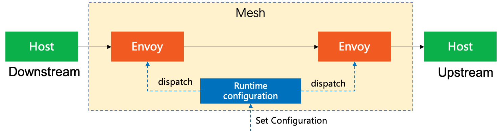

# 玩转Envoy

Envoy是一个全功能的代理中间件,在k8s语境下是事实标准.

<!--more-->

前面我们已经介绍过nginx,它虽然也可以用作代理,而且性能优越,但缺乏一些关键特性让他使用起来没有那么方便,envoy可以理解为为了解决nginx一些功能缺失而生的工具.它的主要特性有:

1. 支持动态配置(服务注册和发现)
2. 支持健康检查
3. grpc作为一等公民支持良好
4. 易于集成统计与监控
5. 可以限流

现在k8s语境下几乎所有的组件都基于它和grpc在构建,因此说它是事实标准.

由于我们前面已经介绍过nginx了这边就不细说那些nginx支持的特性和已经介绍过的术语了.

## 准备例子

本文将使用[tensorflow serving](https://github.com/tensorflow/serving)作为被代理的服务,由于它既有http接口又有grpc接口,作为例子再合适不过了.

我们先跑通它的

+ docker-compose

```yaml
version: '2.4'
services:
  tf-serv:
    image: tensorflow/serving
    logging:
      options:
        max-file: 3
        max-size: 10m
    ports:
        - "8501:8501" # http
        - "8500:8500" # grpc
    volumes:
        - "./testdata/saved_model_half_plus_two_cpu:/models/half_plus_two"
    environment:
        MODEL_NAME: half_plus_two
    cpus: 1
    mem_limit: 500m
    restart: on-failure
    command: ["tensorflow/serving", "&"]

```

## Envoy作为代理

Envoy根本上来说还是个代理中间件,所以这部分我们介绍Envoy作为代理是如何工作的.

### 架构

Envoy一般在生产环境是组网使用,也就是按层次传递请求和响应.整个代理的业务架构如下



| Concept                 | 概念       | 描述                                                                                                                                                           |
| ----------------------- | ---------- | -------------------------------------------------------------------------------------------------------------------------------------------------------------- |
| `Host`                  | 主机       | 能够进行网络通信的实体(如移动设备,服务器上的应用程序).在Envoy,主机是逻辑网络应用程序.一块物理硬件上可能运行有多个主机,只要它们是可以独立寻址的.                |
| `Downstream`            | 下游       | 和nginx中一致,下游主机连接到`Envoy`,发送请求并接收响应.                                                                                                        |
| `Upstream`              | 上游       | 上游主机接收来自Envoy的连接和请求,并返回响应.                                                                                                                  |
| `Mesh`                  | 网格       | 一组主机,协调好以提供一致的网络拓扑.在本文档中`Envoy mesh`是一组`Envoy`代理,它们构成了分布式系统的消息传递基础.这个分布式系统由很多不同服务和应用程序平台组成. |
| `Runtime configuration` | 运行时配置 | 外置实时配置系统,和`Envoy`一起部署.可以更改配置设置,影响操作而无需重启`Envoy`或更改主要配置.                                                                   |

而在每个envoy实例内部其结构如下:


| Concept    | 概念   | 描述                                                                                                                                        |
| ---------- | ------ | ------------------------------------------------------------------------------------------------------------------------------------------- |
| `Listener` | 监听器 | 监听器是命名网地址(例如端口,unix domain socket等),可以被下游客户端连接.`Envoy`暴露一个或者多个监听器给下游主机连接,listener可以定义过滤器来 |
| `Router`   | 路由   | 路由是一组将虚拟主机(virtual hosts)与群集(cluster)匹配的规则(rule),允许创建流量转移规则                                                     |
| `Cluster`  | 集群   | 集群是指`Envoy`连接到的逻辑上相同的一组上游主机                                                                                             |
| `Endpoint` | 端点   | Envoy将`端点(Endpoint)`定义为群集(Cluster)中可用的IP和端口                                                                                  |

### 安装

envoy要么源码编译安装要么直接使用docker,通常大家都是使用docker来运行envoy的.官方提供了`linux/amd64`和`linux/arm64`两种最常见的平台的镜像,使用`docker pull envoyproxy/envoy`就可以拉取得到.

### 使用流程

envoy的启动和nginx一样需要指定配置,在读取完配置之后如果在配置中有设置动态配置的部分则

## 为http服务做代理

### 静态配置

### 动态配置

### 健康检查

## 为grpc做代理

### 静态配置

### 动态配置

### 健康检查

### grpc的xds插件

### grpc-web支持

### 集成prometheus


<!-- ## Envoy的生产环境用法

Envoy在生产环境下一般是两种用法

1. 作为api网关
2. 作为Service Mesh的流量代理

### 作为API网关

什么是API网关?API网关主要功能是作为客户端访问的统一界面,并且可以管理API以确保流量安全.

API网关的主要好处之一是能够将后端系统的复杂性与客户端交互的外向API解耦.

以微服务场景举例,一个应用程序(application)可能由数十甚至数百个松散耦合的服务(service)组成,这些服务通过网络相互通信.通过将系统分解为微服务(基于业务功能的较小组件),开发团队可以比单体设计更快速地交付变更.

然而微服务架构的更大灵活性和敏捷性带来了更大的复杂性.每个服务可能用不同的语言或框架编写并通过API/RPC或消息协议与其他组件进行通信.这就是API网关的作用。API网关不是要求系统外的客户端直接与各种后端服务交互,而是在系统边缘添加一个API网关为外部客户提供一个统一的接入层,网关作为一个抽象层为整个应用提供面向外部的API端点,并掩盖了底层服务的复杂性

在后端和客户端之间有了这个抽象层又增加了一个好处:微服务架构的优势之一是各个团队可以快速,定期发布变更.然而当这些变化涉及到对API的定期更新时客户端可能很难保持更新.使用API网关可以让面向外部的API端点保持稳定,后端变化会影响到从网关到后端的连接而客户端保持不变(除非正在添加或删除功能).

此外对于从单体架构过渡到微服务的组织来说提供一致的面向客户端的接口可以使过渡过程更加顺利因为这样对前端来说是透明的,而后端的变化是隐藏的.

管理 API
API代理只是简单地路由请求和响应，而API网关则提供了围绕管理传入和传出流量的额外功能。网关还可以处理跨多个后端实例的服务发现和请求的负载均衡。在商业化API的情况下，客户根据请求的数量和/或频率付费，网关可以管理不同客户的速率限制。

API网关可以通过金丝雀发布来促进新功能的发布过程。网关将指定比例的传入请求路由到服务的新版本，使负责的团队能够监控问题，同时限制任何失败的影响。一旦团队有信心，流量就会切换到新版本。

网关的配置通常通过命令行界面或管理员API应用的策略进行管理，有些网关还提供管理GUI。

确保流量安全
作为您的应用程序的入口点，API网关的理想定位是确保传入请求的安全和保护您的系统。在网关上实施身份验证和授权可以防止恶意行为者获得对服务的访问，而节流请求的数量和维护白名单和/或黑名单可以降低分布式拒绝服务攻击的风险。API网关还可以管理客户端之间和系统内部的通信加密。

在网关处应用安全性，不仅可以减少潜在的攻击面，还可以确保策略的应用一致且高效。在微服务架构中，集中式管理比要求为每个服务实现相同的功能更有效率，因为要实现的话可能会使用不同的语言和框架。

何时需要使用 API 网关？
虽然API以各种形式存在了几十年，但在过去的10年里，API的数量有了巨大的增长，因为组织越来越多地采用API优先的开发方法。在构建产品时，不是将客户端如网站或基于GUI的应用程序与后端紧密耦合，然后构建和暴露API，以允许第三方与同一系统进行交互，而是专注于提供一个对外的API，该API将被内部和外部的所有客户消费。这样不仅效率更高，而且还能为系统提供更多的使用机会。

举个简单的例子，一家航空公司有一个管理航班时刻表和可用性的系统。同样的API可以被航空公司自己的网站和移动应用以及第三方旅行预订服务使用，无论是面向企业还是面向消费者。虽然API优先的方法避免了新功能发布时的重复工作，但通过网关提供API可避免客户因后端变化而受到不必要的影响，并允许航空公司监控和确保使用、管理性能和交易变现。例如，航空公司可能希望对来自第三方客户端的请求适用不同的速率限制，并根据交易数量收费。

虽然API网关位于后端和客户端之间的边界，但这并不意味着它们必须面向外部。网关的目的是为客户提供一个与系统交互的接口，这些客户端可以是内部的，也可以是外部的。

例如，如果一个组织有多个独立的内部系统，例如一个管理产品订单的系统和一个独立的财务系统，可能需要允许一个系统向另一个系统发出请求。订单管理系统边缘的API网关将允许财务系统请求有关订单的数据。该网关还可以支持一个客户端网络应用，供财务团队用户查看数据和生成报表（进而导致对订单系统的请求）。当然，也可以建立一个由这些功能和数据存储组成的单一系统；系统之间的边界应该在哪里，取决于业务需求和背景。

选择API网关时的考虑因素
在决定一个API网关是否能满足你的需求之前，了解网关不做什么很重要。在围绕微服务构建的系统中，通过网关进来的每个请求必须被路由到相关的服务。只有在后端服务之间已经存在网络和通信方法的情况下，网关才能路由这些请求。在同步通信或异步通信之间进行选择，是按服务实现还是使用服务网格，这都是系统设计的重要部分，是否需要API网关，如果需要，选择哪一个。

选择API网关时，要同时考虑你的架构和部署环境。它们现在是什么样子的，你期望它们如何发展？你可能会从头开始构建一个云原生系统，以便利用容器和自动可扩展性的优势，或者你可能会在内部托管系统，并计划随着系统的发展进行混合部署。一些API网关是为特定环境设计的，而另一些则提供了与您的应用程序一起发展的灵活性。

根据设计，在您的系统中添加一个API网关，会给所有传入和传出的流量增加一个跳转。因此，在为您的系统选择网关时，性能应该是一个关键的考虑因素。并非所有的网关都是一样的，通过网关发送请求所产生的额外延迟会对最终用户产生明显的影响。另一方面，一些网关允许您跟踪请求和响应时间。这些性能数据不仅可以帮助您优化系统，而且还可以在某些东西没有按照预期工作时提供指示。

使用API网关时的最佳实践
作为系统的单一入口和出口点，网关需要确保对系统的访问安全。确保用户在通过之前进行身份验证和请求授权，应用转换以确保响应中只包含必要的信息，以及速率限制和流量节流都可以在网关上实施。

网关作为系统的单一入口点，不应该出现单点故障。稳健可靠的设计是一个良好的开端，但根据系统的正常运行时间要求，您可能希望实现API网关的高可用性集群。有些网关要求为每个实例复制数据存储，从而增加了整体成本，而其他网关则支持单数据库和多数据库实现。

由于所有流量都流经网关，它们是监控流量和观察系统行为理想地点。选择一个能够收集指标、支持日志记录和跟踪并提供分析趋势的仪表板的网关，可以让您更深入地了解您的系统，并使您能够在症状出现时迅速对问题做出反应。 -->

<!-- ### 作为Service Mesh的流量代理

服务网格

#### Sidecar模式(挂件模式)

`Envoy`通常被用做Sidecar模式的组件,,我们可以将这种模式理解为挂载组件.一般一个`Envoy`实例会分为两种:


#### 数据平面与控制平面

数据平面指的是负责有条件地转换,转发以及观察进出服务实例的每个网络包,而控制平面则是控制数据平面的工具.

`Envoy`将自身定义为数据平面,并希望使用者可以通过控制平面(主要是xds接口协议)来为Envoy提供动态配置.
 -->

