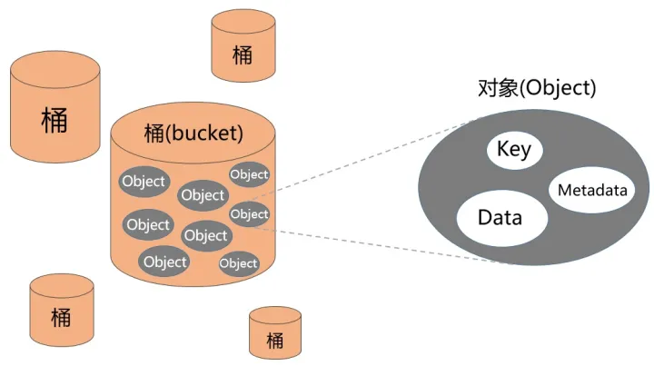

# 玩转Minio

Aws S3应该是最知名的对象存储服务了,它也已经成了事实标准,各家的对象存储几乎都兼容S3接口.而Mino则是一个兼容s3接口协议的开源oss工具.本文将介绍它的部署方式,使用方式.

## 对象存储

对象存储是用于存储非结构化数据的数据存储架构,它将数据划分为单元(对象),并存储在结构扁平的数据环境中.每个对象都包含数据以及应用可用于轻松访问和检索对象的元数据和唯一标识符.

对象存储的可伸缩性强,复杂性低,便于搜索,通常用于保存冷数据.

## S3定义的对象存储

S3定义的对象存储的存储结构分为两层,第一层为`Bucket`,第二层为`Object`.`Object`存储于`Bucket`中.可以创建多个`Bucket`，每个`Bucket`中可以存储多个`Object`.`Bucket`就像文件夹,起到namespace的作用,是访问控制的基本单位,而`Object`更像文件中的文件.S3中的`Bucket`下是不允许有`Bucket`,也就是说在S3中可以理解为是只有一层文件夹的文件系统.



## S3的访问方法

S3的访问方法一般两种,也就是sdk方式和http方式.

### SDK方式

sdk方式最大的好处自然是符合不同语言的编程习惯.缺点是需要针对编程语言找适配的包

+ Go语言SDK[minio-go](https://github.com/minio/minio-go)
+ Python的SDK[boto3](https://github.com/boto/boto3)
+ C++的sdk[aws-sdk-cpp](https://github.com/aws/aws-sdk-cpp)我们只需要安装其中的`core`和`s3`即可
    ```bash
    cd /tmp \
    && git clone --recurse-submodules https://github.com/aws/aws-sdk-cpp.git /tmp/aws-sdk-cpp \
    && cd /tmp/aws-sdk-cpp \
    && mkdir build && cd build \
    && cmake .. \
        -DBUILD_ONLY="core;s3" \
        -DCMAKE_BUILD_TYPE=Release \
        -DBUILD_SHARED_LIBS=OFF \
        -DCUSTOM_MEMORY_MANAGEMENT=OFF \
        -DCMAKE_INSTALL_PREFIX=/musl \
        -DENABLE_UNITY_BUILD=ON && \
    make && make install
    ```

### HTTP方式

http方式通用性更强,但由于s3设计的比较早,可以看到请求和响应的body使用的并不是现在流行的json而是上一个时代的xml作为序列化协议,因此现在手写起来会比较不习惯,具体的接口信息可以查看[官方文档](https://docs.aws.amazon.com/zh_cn/AmazonS3/latest/API/API_GetObject.html).不过一般没人会去用http方式.

## 使用Minio存储和调取静态数据

如果我们设置Bucket的访问权限为`public`,那么就可以没有权限限制的下载其中的object,其url为`http://hostname:9000/Bucket/object`.这种方式非常适合用来存放网页用到的静态资源.

## Mino部署

Mino部署方式还是比较灵活的,官方支持docker和k8s部署,我们也可以比较容易的使用swarm部署.

### 单机部署

```yml
services:
  minio:
    image: minio/minio:RELEASE.2022-10-29T06-21-33Z
    logging:
      options:
        max-file: 3
        max-size: 10m
    ports:
      - 9000:9000
      - 9001:9001
    volumes:
      - ./minio/data:/data
    environment:
      - MINIO_ROOT_USER=admin
      - MINIO_ROOT_PASSWORD=admin1234
    command:
      - server
      - /data
      - --console-address
      - ":9001"
```


### swarm集群部署

```yml
services:
  minio:
    image: minio/minio:RELEASE.2022-10-29T06-21-33Z
    hostname: '{{.Node.Hostname}}'
    logging:
        options:
            max-file: 3
            max-size: 10m
    ports:
        - mode: host
          protocol: tcp
          published: 9000
          target: 9000
        - mode: host
          protocol: tcp
          published: 9001
          target: 9001
    volumes:
        - ./minio/data:/data
    environment:
        - MINIO_OPTS="--console-address :9001"
        - MINIO_ROOT_USER=admin
        - MINIO_ROOT_PASSWORD=admin1234
    command: 'server http://<node的name>/data http://<node的name>/data ...'
    deploy:
        mode: global
    
```

### 使用示例

```python
import boto3
s3 = boto3.client(
    "s3",
    endpoint_url="http://localhost:9000",
    aws_access_key_id="admin",
    aws_secret_access_key="admin1234",
)

response = s3.list_buckets()
s3_target.Bucket('test01').put_object(Key='test.json', Body=json.dumps(rows))
with open('test_copy.json', 'wb') as f:
    s3.download_fileobj('test01', 'test.json', f)
```


