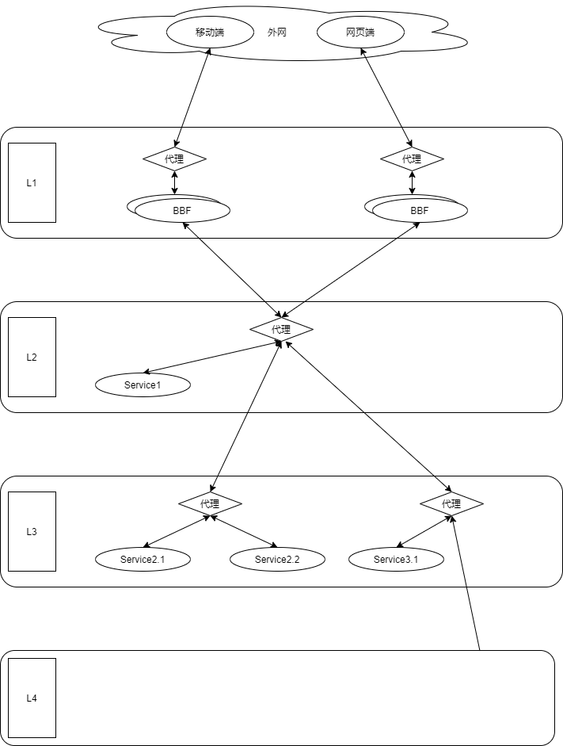

# 微服务架构

微服务架构是当今流行的一种应用构造形式,与之相对的概念是单体应用架构.在了解微服务架构之前我们先来明确几个概念.

## 概念定义

> 业务

指的是需要处理的事务(功能)的集合.比如github的业务就是提供代码托管及相关的功能.业务是有拓展性需求的,比如github开始只是托管代码加社交功能,后面又加上了项目管理功能,又加上了文档静态页面托管功能,又加上了cicd功能等,鬼知道后面还会有什么新功能.

> 领域

指的是实现特定业务功能需要的专业范围.比如cicd功能需要使用到沙盒,虚拟化等领域的知识

> 应用

解决业务全部需求的实现,比如github这个站就是他们公司业务对应的应用.

> 服务

应用需要业务功能或者领域技术的实现

> 接口

服务提供的交互入口

## 单体应用架构

要实现业务需求,最简单最自然的想法就是写个服务来实现全部功能,这就是单体应用了.

单体应用的特征是一个应用对应一个服务.因此结构最简单,使用的也最多.

单体应用的复杂性体现在服务内部,由于需要实现所有功能,在业务复杂功能需求很多的情况下往往不是一个人或者小团队开发而是一个大团队开发.
这就给开发,维护和后续扩展带来了更大的复杂性.单体应用面临的最大困境就是在于业务复杂的情况下项目管理的的复杂度随成员数量成指数级增长(复杂度只要来自沟通成本,论点来自于人月神话).

除了上面的点外单体应用还有2个缺点:

1. 单体应用对于功能复用也很不友好.要复用其中的某一功能或者领域技术的实现只能是代码级的复用(内部调用程序接口,外部复制代码).
2. 单体应用的鲁棒性不好,要挂就所有功能都挂.

但是大多数时候这些问题其实是不存在的,因为多数企业或者项目都成长不到这种复杂度就会走到生命的尽头...而它的优点--结构简单此时就足以让人选择这种架构了.

## 微服务应用架构

微服务应用架构其实也是在单体应用架构下很自然的一个发展.如果一个服务过于复杂我们可以将功能拆分后做成几个独立服务来降低单个服务的复杂度.这是一种分治思想的应用.它也确实可以解决单体应用面临的最大困境--由于团队过大造成的项目管理复杂度过大.

通过拆分功能,每个小团队甚至个人只需要实现几个功能,而功能间的相互调用则是走web接口.

我们知道复杂性不会消失只会转移,微服务的复杂性实际上只是从项目管理方面转移到了服务的拆分与集成和服务治理上.

那么是否真的值得呢?这就得看应用规模了.还是那句话,小应用简单应用犯不着上微服务,但一旦规模扩大到一定程度(个人经验是4个人维护吃力的程度)那就应该开始渐进的使用微服务架构.关键是要在拆分这件事情变得太过昂贵之前意识到你需要做这个拆分,否则你会付出惨痛代价.

### 服务的拆分与集成

第一块增加复杂度的地方就是服务组织,因为微服务实际上已经不是一个"软件"了而是一个"系统",就像单细胞生物演化为多细胞生物,服务之间天然的有了区分而他们间交互只能通过api走内网方式,这带来了如下变化:

1. 我们必须考虑通信效率.服务间通信的效率必然不如服务内通信,通常是1000倍以上的性能差别.
2. 我们必须考虑通信形式.我们在单体应用中通常使用函数(同步)和队列结构(异步)来处理信息,在微服务架构下,服务间的协作形式被接口(同步)和消息中间件(异步)替代了.由于通信的成本增加了我们就必须充分考虑应该使用哪种方式通信以更好的适应业务需求
3. 我们必须考虑服务的独立性.如果一个功能无法独立实现而有一大堆的外部依赖,那就失去了拆分的意义,因为大量的外部依赖必然带来性能的羸弱和可维护的降低
4. 我们必须考虑服务的水平扩展性.在单体应用中性能瓶颈可能是几个函数,而微服务架构下可能是几个服务.要解决性能瓶颈最直接的方式就是部署更多的服务实例做负载均衡.这种时候水平扩展性就至关重要.
5. 我们必须考虑接口的形式.接口的形式决定了调用方的体验和网络通信性能的上下界

#### 服务边界的确定

和模块设计一样的原则,还是高内聚低耦合.通常我们确定服务边界的依据应该按

1. 业务功能的天然划分,比如一个音乐应用可以天然的被分为用户,音乐库,支付,推荐四个大块,在分好后这4个大块的接口和交互模式实际上就已经确定了.这种划分看似是直觉其实是对其内聚性的一个判断.
2. 按依赖程度确定功能的从属关系,比如用户的消费订单管理天然的应该从属于用户而非支付,因为它对用户的信息依赖程度更高,支付只要实现支付功能并维护一份对账单即可
3. 如果一个事务(多步执行的原子操作)会被拆分到不同的服务,则不可以拆分.比如如果支付成功需要写两张表,而两张表会被两个服务使用则这两个服务应该归入支付而不是拆除去

事实上上面的划分并不是最终划分,我们也可以将每个业务块再更进一步的细化成颗粒度更小的服务,这就是服务分层了.比如推荐业务块可以进一步拆分成推理引擎,数据收集处理,而推理引擎又可以拆分成召回,精排,探索,强推等等等等,我们在做服务拆分的时候应该渐进式的进行,在复杂度没到的时候不用过早拆分.甚至我更加推荐从单体应用逐渐过渡到微服务应用,从粗颗粒度逐渐过渡到细颗粒度.

而在这个拆分过程中我们应该遵循如下原则:

1. `应该确保按层拆分每层的接口不变`.将一个粗颗粒度的服务拆分为一组细颗粒度服务时应该保证被拆的粗颗粒度服务接口被细颗粒度服务组完全继承和实现,为了实现这个能力我的建议是无论拆分前后都在这层服务外挂一个代理.这层的所有接口都必须通过这个代理来访问.通常我们的选择是nginx或者envoy
2. `应该至少确保跨层服务间不共享数据`一般来讲我们应该确保各个服务独立,但这有时候真的很难,因此这里退一步讲至少确保跨层服务间不共享数据.共享数据实际就是共享状态,如果非要共享状态,那么应该注意如下几点:
   1. 做好使用文档,说明好使用规范
   2. 确保至少读写分离
   3. 如果存在竞争,给共享数据上分布式锁
   4. 用缓存而非持久化存储
3. `应该确保使用最合适的技术实现服务`,这算是充分利用微服务的优势,我们不再需要拘泥于特定技术栈,而是应该选择合适的技术栈,比如io密集的业务可以用go写,计算密集型任务用c++写,快速原型实现不考虑性能就用python等等.
4. 避免过早优化,通过监控随时找出应用的瓶颈,提前规划拆分方案,但在没有碰到应付不过来的情况时不要提前拆分.
5. 拆分一定要确保业务可拆分,不能拆分后影响结果.尤其是当业务有原子性需求时不能拆分.

#### 向前扩展的`BFF`(Backends For Frontends,为前端服务的后端)

实际上前面我们并没有讨论前端,而是完全的讨论后端服务.但很多情况下后端需要向前端的限制妥协,比如网页通常是在宽带条件下使用,移动端是在4g/5g条件下使用;网页屏幕大可以用大图,移动端通常用小图等,这些都是交互层的东西但往往需要后端做相应的适配.一个最常见的方式就是将这些影响前端交互的后端代码整体抽出来单独作为一层放在最前面,这类为前端服务的后端缩写为`BFF`.而业务逻辑则放在这一层之后.

这样一个应用的结构示意图大致可以看作是这样

#### 接口形式的选择

微服务通常接口形式就2种:

1. 基于HTTP协议的`RESTFul`接口,通常是`JSON-RESTFul`接口.常用于提供资源,优点是语义化接口风格通用,简单,轻量,缺点是模式约束不严格,性能略弱
2. `RPC`接口,通常是`GRPC`,`Thrift RPC`或者`JSON-RPC`接口,常用于提供操作.优点是调用方便,模式严格,缺点是比较重,而且接口风格不通用.一般只在内网使用

当然还有一些其他不常用到可能会需要的形式:

1. 基于`Websocket`的双工接口,优点是性能好,支持双工通信,缺点是调用不便,也没有什么通用的接口风格,一般只在追求高性能的场景下使用
2. 基于`SSE`技术的服务端推送接口,优点是调用方便,缺点是性能一般,也没有什么通用的接口风格,一般在需要有推送的场景下使用

在什么地方使用什么样的接口形式呢?

通常最外层(第一层)要求必须都是HTTP协议的接口,因为http协议比较通用可以直接给前端和移动端使用.而且第一层的`BFF`应该遵循宽进严出的鲁棒性准则,即对于请求数据尽量给与反馈

从第二层开始所有的api就都在内网环境了.我们就要考虑一下了,一般我们遵循如下原则:

1. 接口形式一致,从上到下我们的接口形式应该完全一致.
2. 接口的数据规范一致,从上到下我们的接口数据的应该使用相同的方式描述,且可以校验.
3. 接口只为符合规范的数据提供服务.

只要遵循上面3点这样便于可以降低维护成本,让你的应用更加可控.

#### 同步还是异步

服务间的通信形式一般可以认为是两种,即同步方式和异步方式.

+ 同步方式就是简单的请求-响应模式--客户端请求数据,服务端处理请求后返回结果.这种方式适合那些不需要长时间处理的任务
+ 异步方式就会复杂一些--通常是生产者发送一个消息到队列中,然后监听这个队列的消费者获取到数据后处理,处理好后通知结果的收集者.这种通常都是那些需要长时间处理的任务或者至少是对实时性要求不高的任务--比如生成报表.

这两种通信形式谈不上谁好谁差,而是使用的场景不同.对于微服务架构而言,第一层接口应该要对同步和异步形式的任务都可以支持,而其他各层则根据功能需求确定使用同步还是异步接口

第一层接口异步的话一般就两种思路:

1. 用websocket,
2. 用sse.
3. 用轮询

个人更加推荐sse.因为客户端的对接成本更低,纯文本传输数据也可以存json字符串,基本可以满足要求.

如果是使用sse,那么我们可以定义一个接口专门用作广播消息,比如`/channel/<channel_id>`,当客户端发起一个异步任务的请求时返回给它这个`channel_id`,客户端拿这个id请求广播接口就可以建立一个长连接,然后客户端只要维持这个请求就可以等到异步任务的结果了

第二层开始后面的的每一层,如果要使用异步通信的话,比较建议的形式是使用一个事件总线.这个事件总线通常用`stream`结构,一般用`kafka`,当然了规模小的时候用`redis`的stream结构也可以.

具体这么用:

1. 只使用一个事件总线,这样便于管理
2. 事件使用topic区分
3. [可选]事件内部子项使用`key`区分(redis中不存在key,因此事件文本中第一层为`key`和`value`两个字段)
4. 事件分为两个字段
   1. `meta`字段,用于描述事件元信息,主要是事件发送者信息和事件唯一id(通常用snow-flake算法或者uuid4)
   2. `payload`字段,用于传递事件负载

5. 不同的服务应该将服务名作为消费者组的名字,而服务的实例则作为消费者.
6. 消费完的结果应该作为消费服务的一个状态保存(可以是带过期的缓存),而消费服务也应该提供查询消费结果的接口(同步加异步)

#### 有状态服务和无状态服务

在微服务设计的时候我们需要考虑状态的保存.我们希望我们的每个服务都是无状态的这样就可以水平扩展,但几乎没有业务是无状态的.因此必然会有状态保存,我们应该尽量避免本地状态,而应该使用共享缓存,数据库,nfs等有状态服务保存状态.最不济在原型和小规模应用阶段可以使用本地内存和Sqlite,但一定要考虑好后续如何扩展为使用有状态服务.

有状态服务一般是两种:

1. 持久化存储,可以理解为和单机的硬盘对应,常用的有
   1. 关系数据库管理系统(比如postgresql)适用于对原子性事务操作有要求的OLTP场景
   2. 文档数据库(比如mongodb),常用于保存邮件,文档,评论,内容信息等,适用于对原子性事务没有操作要求且存储数据没有模式或者模式不清的的OLTP场景
   3. 列存储数据库(比如cassandra,hbase),常用于保存append-only数据,一般用于保存事件,log信息等,一般用于OLAP场景
   4. 对象存储(比如aws s3),常用于保存静态数据,一般是文件视频什么的,一般就是保存而已,服务中通常只是返回其地址让前端自己去取

    这类有状态服务需要根据业务挑选.

2. 缓存,可以理解为单机的内存,一般用于运行时临时存储,常用的基本就redis

这里使用有状态服务保存状态有如下几点限制:

1. 如果要服务间共享状态,一定用缓存而不是持续化存储,持久化存储会让人产生惰性不愿意降低对它的依赖,久而久之持久化存储就会成为一个造成强耦合的公共接口,后续会难以解耦.
2. 第一点的扩展,一个服务控制的数据应该对服务外隐藏细节,服务应该通过接口与外部交互状态.
3. 服务应当共享缓存给其中的每个实例而不要单独使用本地内存做缓存.这是为了保证每个服务数据的一致性.

##### 微服务与数据库

和服务最相关的一般来说就是数据库了,而最容易出问题的也是数据库设计.数据库技术本身提供了大量异常好用的工具和特性(尤其是成熟的关系数据库)惯坏了开发人员,在单服务应用的情况下我们很容易让数据库的表结构和表关系与服务本身耦合在一起,当需要拆分时问题就来了.

微服务架构下我们使用数据库有如下原则:

1. 使用事务的原子操作不能拆分到多个服务
2. 不同服务不能共用同一张表.一旦共用一张表就相当于服务间通过数据库接口与外部交互了,也就造成了服务间因为数据库耦合了.

怎样确保数据库使用没有问题呢?一个简单的方法是服务的第一版实现中不用外部数据库.你可以先用sqlite,或者直接从一个文件中读写数据.当测试没有问题后改用外部数据库实现.

如果使用的是关系数据库,建议不要直接使用SQL语句而是使用orm技术.这会避免sql注入同时让代码和具体数据库解耦.

### 服务治理

另一部分变得复杂的就是服务治理了.在单服务应用情况下服务治理相对简单,我们的所有操作都只要登录到宿主机后就可以手工进行:

+ 手工部署,停机,替换文件.重启
+ 手工测试,借助脚本测试功能
+ 手工监控,log打到指定宿主机路径出问题就查log

这在单服务应用或者简单微服务架构的情况下没什么问题,甚至因为结构简单还有一定灵活性方面的优势,但一旦服务规模扩大(个人经验只要物理机超过3台就已经非常繁琐了)就很难满足快速迭代交付的需求了.

微服务治理经过这么多年的实践总结基本上可以说已经有了一套成熟稳定的综合方案,那就是基于CI/CD工具的自动化服务治理框架.大致会用到如下工具:

1. CI/CD工具(jenkins/gitlab-runner/github-action)用于测试和触发部署
2. nginx/envoy,用于作为分层网关
3. docker->docker swarm用于部署服务
4. Prometheus[ELK]用于监控和收集log同时提供异常警告

然后还会视情况选择使用如下工具:

1. k8s+Istio+envoy,用于组Service Mesh来部署服务

这些工具本文就不一一介绍了,一些工具我们会在后面的文章中介绍.

可以看出现代微服务架构的治理最核心的就是CI/CD的应用和Docker体系的使用.

#### CI/CD的应用

CI/CD由来已久,在单服务应用下一般用来做测试和编译.而在基于docker渐进式演化的微服务架构下CI/CD工具的作用一般分解为如下几步

1. 单元测试
2. 服务测试
3. 打包镜像入库
4. 触发部署操作

为了可以更加方便的做上面的操作,有如下基本原则:

1. 一个代码仓库管一个服务
2. 在CI/CD工具的网络空间内应该事先部署好服务测试用的桩服务(固定请求固定响应的服务)
3. 服务要将默认配置置为测试用的配置
4. 服务的配置要可以从命令行,环境变量和配置文件三种渠道中读取,且统一优先级顺序
5. 不同分支管理不同的部署位置和镜像的标签

##### 测试

微服务相对是比较好测试的,很多微服务很小,只有一只手数的过来的接口,因此我们完全可以对单个微服务做完整的服务测试,这也是微服务架构的优势之一.

通常我们会要求对微服务项目做覆盖率90%以上的单元测试,而服务测试也应该所有接口的所有预期情况都测试到.最后针对整个应用的测试(端到端测试)则不会做强制要求.

由于微服务一般都会有一些依赖,这就需要先把依赖打桩,我们可以使用[mountebank](https://github.com/bbyars/mountebank)构造打桩服务.它也有插件[mountebank-grpc](https://github.com/cbrz/mountebank-grpc)支持grpc接口.

虽然不会强制要求端到端测试,但也不是说就不测了,通常我们会使用`消费者驱动测试`进行功能验证,说白了就是模仿某个服务组的用户行为测试是否符合预期.

个人建议在每次服务拆分时保留原有项目的仓库,并为其创建`test`分支专门用于保存`消费者驱动测试`的代码和`端到端测试`的代码,并为这个分支设置ci配置,可以通过触发执行测试环境上的对应测试用例.

##### 部署

首先一个,部署不等于上线,虽然现在使用docker体系线上和测试已经很难再有多少不同了,但很多外部依赖的有状态服务还是会有不一致,因此部署可以遵循如下原则:

1. 尽快部署早发现问题
2. 流量不要一次打进生产环境新部署的服务,而是应该通过负载均衡策略先放一小部分,等到测试符合预期再完全开放(金丝雀发布)

#### Docker体系的使用

docker体系已经是现在的主流了,但如何使用docker体系依然是一个问题.docker体系解决的是服务和宿主机间关系的问题,具体就是我们应该用几台宿主机?每台宿主机应该是什么样的配置,每台宿主机上部署哪些服务?

本文倡导的是在渐进式演化的思路下使用微服务,因此这里也以渐进式的方式大致给出一个docker体系使用的路线图

1. `单宿主机--docker-stand-alone(共两台机器)`,业务初期我们应该直接上docker,它起码可以解决自动重启和自动化部署的问题.但没必要上集群,毕竟也就一台机器.但请在这个时候就部署一台额外的主机用于监控和log收集.收集来的数据往往可以支持决策业务的发展方向,其实是很重要的.但因为数据量不大,完全可以单机解决.
2. `3台宿主机,单体应用--docker-stand-alone(共4台机器)`,业务量上来了我们会有做负载均衡和容灾的要求,这个时候并没有必要拆分单体服务,但已经可以开始规划了.在这种情况下建议如下方式扩展:
    1. 一台主机用作部署envoy和其他服务注册服务发现工具,专门用于作为流量入口.注意一定不要用作其他作用
    2. 另外两台主机用于部署应用
    这三台机器目前还没有必要组成集群.

3. `3台宿主机,微服务应用(服务数小于10)--docker-swarm(host网络模式)(共4台机器)`一方面业务量上来了,一方面业务领域也会进行扩展,这个时候就要开始实施拆分了.在这种情况下建议如下方式扩展:
    1. 使用3台宿主机构造一个swarm集群(三台都作为manager),同时为部署envoy那台机器设置标签`gateway`和`<应用名>`,为其他机器添加`<第二层各个服务组名>`的标签
    2. envoy部署到标签为`gateway`和`<应用名>`那台机器
    3. 另外两台主机用于部署应用,部署在`<第二层自己所在服务组名>`的标签上,且使用`global`模式部署.

4. `4-6台宿主机,微服务应用(服务数小于10)--docker-swarm(host网络模式)(共5-9台机器)`在业务量3台机器已经压不住的情况下(这个业务也已经不小了)我们应该分析log,找出负载最高的服务,然后增加机器为其扩容.新增进去的机器可以都是worker节点,这些节点只打上需要扩容微服务所在服务组的名字作为标签.在这种情况下我们的监控可能也不堪重负了,这时候就需要对其扩容,同样的就是组集群.而如果`gateway`节点也扛不住了那么目前阶段只能升级节点解决.

5. `7-10台宿主机,微服务应用(服务数小于10)--docker-swarm(host网络模式)(共10-13台机器)`这个阶段我们就差不多该将服务向前拆分`BBF`了,也很简单.新增的机器打上标签`BBF`和`<自己服务的前端名>`部署的时候就服务啥就找标签为`BBF`和`<自己服务的前端名>`的宿主机放就行了.

6. `11-25台宿主机,微服务应用(服务数小于100)--docker-swarm(host网络模式)`,这个阶段实际上你的业务已经算是个庞然大物了你要做的就是
    1. 继续拆分服务,添加主机为你快扛不住的服务扩容
    2. 适当增加监控的主机适应需求.

    但到了这个阶段你会发现主要问题已经成了服务太多太杂,管不过来,这种时候就可以开始考虑使用k8s和service mesh了.

7. `26+台宿主机,微服务应用(服务数打于100)--k8s+Istio+envoy`,这个方案是渐进式扩展的最终状态,你依然可以在这套框架下继续拆分服务继续增加监控.

这里补充几点:

1. 不是说k8s不适合小规模集群,借助[k3s](https://k3s.io/)我们甚至可以把k8s部署在树莓派上,但一般来说没必要,毕竟swarm是docker自带的学习成本也低很多,尤其在业务前期人力不足的情况下用k8s属于找不自在,除非你需要gpu集群或者你要用k8s部署spark/dask这样的计算框架(这个以后讲数据架构的时候再说).

2. 不是说swarm不能适用于大规模集群,实际上能而且性能可能更好(必须有很好的组织并且网络使用host模式),但转用k8s在管理上会有更多优势,比如更精细的网络和挂载管理,更精细的部署策略管理等.关键的这个时候你应该有人力用k8s了.

3. 不要使用swarm的overlay网络,性能太差不堪大用.

4. 上面的模型只是应用的上升期,当业务进入稳定期和下降期,我们必然会降低迭代速度,降低人员成本和运行成本,这个时候就该是上面模型的反转--从大规模分布式系统渐进的缩回单体应用.

关于docker体系的介绍本文只是简单介绍,我会有专门的攻略,不过写完需要时间.

## 微服务架构与敏捷

微服务架构是否可以适应敏捷开发模式,这是这部分要探讨的问题.在讨论这个问题之前,我们先来谈谈敏捷.

### 什么是敏捷

以我的经验,不同角色的人用"敏捷"一词指代的往往不止一件事情.

首当其冲就是pm口中的软件开发的敏捷方法:快速行动,拥抱变化,持续交付,接收反馈等不一而足.

相对的对于开发者来说,"敏捷"的意思是人们如何在敏捷环境中一起工作,通常包括了团队动态,系统思维,心理学以及其他可能会跟创建高效团队联系在一起的事情.

无论是哪种,对于软件架构来说,"敏捷"的含义更多的是能过应对所处环境变化,适应人们提出不断变化需求的能力.

因此并不是敏捷团队创建的软件架构就是敏捷的软件架构.恰恰相反,往往敏捷团队更加关注交付功能,而往往忽略架构上的扩展性.

要理解一个软件架构需要多敏捷就应该看看敏捷究竟是什么.美国空军战斗机飞行员约翰-博伊德(John Boyd)提出了一个名为`OODA`循环的概念.本质上这个循环构成了基本的
决策过程.

> 想象一下你是一个正与敌人缠斗的战斗机飞行员,为了击败对手你需要观察情况,确定自己的方位(比如做一些分析),决定做什么,并采取行动.在激烈的战斗中为避免被对手击落,这个循环要执行得尽可能快.博伊德说如果你能洞悉对手的`OODA`循环,执行得比对手更快,就能混淆视听误导对手.如果你比对手更敏捷,就能成为最后的赢家.

将其应用于软件开发,我们可以得出的结论是:

> 敏捷是相对的,且按时间来衡量.

如果你的软件团队交付的软件跟不上所处环境的变化就不算敏捷.而这个所处环境就取决于你的参照物,如果在一个庞大而行动缓慢,鲜有改变的组织中工作很可能交付软件要花费数月却仍被组织认为是"敏捷"的,而在一个精益初创团队中,情况多半就不一样了.

### 微服务和敏捷是天生的一对

为什么这么说呢?

+ 一个微服务通常可能不到1000行代码.如果需要改变,服务甚至可以用另一种语言另一套技术栈快速重新编写.从而提供了小型,松耦合的组件和独立构建独立修改独立测试独立部署的能力.
+ 微服务架构下比较适合的组织形式是3-5人小队形式,这种小团队组织形式可以让所有人用最低的沟通成本完成最专业的需求.提供了足够的灵活性.
+ 微服务天生需要依赖大量自动化工具,天生支持持续集成持续交付
+ 天生需要监控有利于收集反馈有针对性的进行优化

但具体如何构建微服务架构和与之对应的开发团队取决于我们要多"敏捷".在我看来为了过分敏捷牺牲可维护性是不可接受的.下面是使用微服务架构实践敏捷的注意事项:

1. 确保基础设施(CI/CD工具,部署环境,监控log收集工具)稳定.实际上微服务架构可以理解为将软件开发的复杂度分散转移到了运维和架构两块,好在这样做降低了人的参与程度,因此可以大量使用工具简化操作从而降低复杂操作的出错机率,但错误总是难以避免的,我们需要将基础设施的稳定看的比服务开发更加重要,这样才能不影响整个工作流,可以理解为生孩子难产时候的保大保小问题,基础设施就是大人,服务本身就是娃,正常人都会保大吧,但很多企业并不知道这里面的逻辑.

2. 确保所有开发人员使用一致的开发规范(代码风格和测试原则). 即便拆分了应用,我们也应该将所有服务看作时同一个应用的一部分,在单体应用中我们无法接收代码风格和测试原则不一致,微服务中一样无法接收.毕竟当应用的生命周期进入尾声,可能应用的维护人员和组织结构会又一次回到单体,这个时候如果这些基本规范无法一致那将是维护的灾难.

3. 每个服务的代码仓库应该组织内部开源,并允许其他组织的成员提交工单和pull request.这个方式可以有效避免人员变动造成的青黄不接,也可以更好的了解消费端的需求从而提高服务质量.

4. 确保维护同一服务的小队人员在物理上在一起工作,越是专业化细分领域的服务越需要细粒度的沟通,而细粒度的沟通就目前的科技来说还是只能当面沟通.像视频会议,电子邮件这类粗粒度的沟通形式是无法深入讨论的.

5. 确保人员划分和限界上下文一致,这样即便一个团队维护多个服务这些服务也是相关的,这样可以大概率避免孤儿服务(无人维护的服务)

6. 确保小队与小队之间有接口文档约束,由于微服务见数据交换完全靠接口,因此接口约束非常重要,最常见的解决方案就是开发前先定义好接口.即便接口定义的不符合业务的更新要求,也应该通过版本迭代

7. 确保每个服务的每个版本要有设计文档和版本变更文档,这样即便出现孤儿服务也不至于没有人有能力维护.

8. 确保服务的接口变更是软性的,并允许高版本和低版本共存至少3个二级版本.同时必须在新版本的文档中明确标识出过期接口和接口过期版本.
