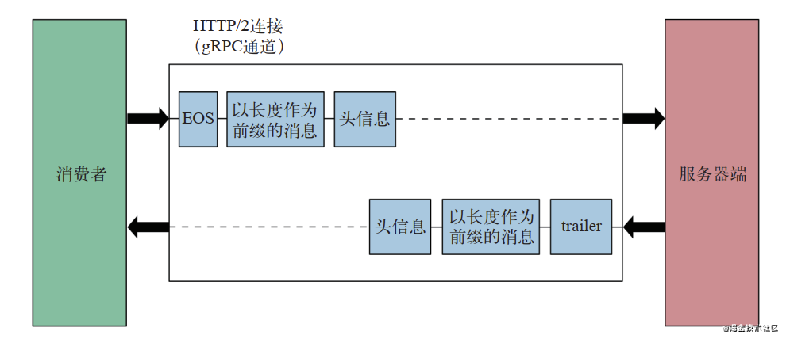
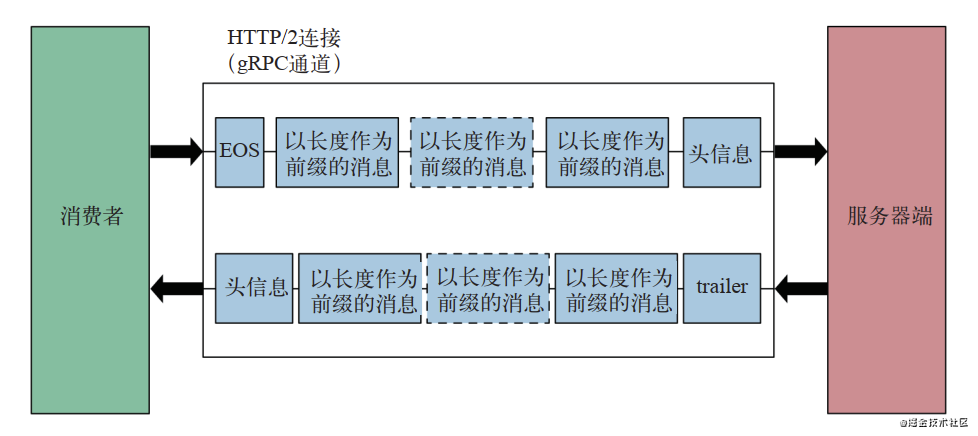

# GRPC接口服务

[GRPC](https://grpc.io/)正如其名,是目前应用较广的一种RPC(Remote Procedure Call)协议.

<!--more-->

## RPC

RPC(Remote Procedure Call),远程过程调用.它的设计目标就是希望调用起来和使用本地的函数一样简单.也就是说RPC只是一种形式,本质上还是一种请求响应模式的服务.

RPC技术由来已久,也很早就被应用,比如jsonrpc,xmlrpc这些.但多数RPC技术也有一些顽疾:

1. 语言绑定

    RPC技术既然是让远程调用像本地调用一样使用的技术,那必然会和"本地调用"的语言绑定.几乎没有一个RPC技术可以说是语言无关的,只是支持的语言多少的问题.

2. 本地调用和远程调用并不相同

    RPC的核心想法是隐藏远程调用的复杂性,但是很多RPC的实现隐藏得有些过头了,而会造成一些问题.
    1. 使用本地调用不会引起性能问题,但是RPC会花大量的时间对负荷进行序列化和反序列化,更别提网络通信所需要的时间.这意味着要使用不同的思路来设计远程和本地的API(需要考虑rpc的服务端是否可用等).简单地把一个本地的API改造成为跨服务的远程API往往会带来问题.
    2. 由于隐藏的太好开发人员会在不知道该调用是远程调用的情况下对其进行使用.这会进一步放大上面的问题
    3. 数据冗余,如果一个函数它的返回值有数据冗余,我们往往还是可以到处复用的,因为除了一点内存外几乎没有成本,但RPC不同它的返回和函数一样也是固定的,所以冗余数据会沿着网络整个传过来,这就造成了序列化反序列化时cpu内存的浪费以及网络带宽的浪费.成本就高了

上面说这么多当然不是说RPC不好,恰恰相反,RPC是非常好用的工具,在拆分服务时改动最小,而且也最好维护.所有大厂都会使用RPC技术,很多开源项目如tensorflow都会有rpc的应用.

比较常用的关于grpc的资料集合维护在[awesome-grpc](https://github.com/grpc-ecosystem/awesome-grpc)项目.

## GRPC

GRPC是谷歌开源出来的一个RPC协议,目前官方有3大类实现

1. C实现
2. golang实现
3. java实现

而C实现又绑定了大量其他语言的接口,比如python,node,C#,C++等.从使用的技术上来说它使用HTTP2协议作为传输协议,protobuf作为序列化协议.加上社区一直以来的优化,总体而言GRPC在各种RPC协议中性能属于上游水平.但与其说GRPC是一个RPC技术,不如说它是一套解决方案.GRPC官方实现了一整套包括反射,健康检测,负载均衡和服务发现,debug性能调优等在内的工具和模块,无比庞大无比复杂.老实说想都整明白还是有点费劲的.本文的目的就是把GRPC和与其配套的技术整体理一理,并给出一个相对通用的使用模板来.

不过由于我不会java,所以本文只会介绍C实现(以python为例)和Go实现.C实现绑定的语言过多,就不一一介绍了,我用到了会进行补充.

## 基本使用

GRPC的基本使用流程是:

1. 服务端与客户端开发者协商创建一个protobuf文件用于定义rpc的形式和方法名以及不同方法传输数据的schema
2. 客户端和服务端分别编译这个protobuf文件为自己需要的目标语言的模块
3. 服务端:
    1. 导入protobuf文件编译成的模块
    2. 继承定义service服务类(go语言是自己创建类)
    3. 实现service服务类其中定义的方法
    4. 这个类的一个实例注册到grpc服务器
    5. 启动grpc服务器提供服务
4. 客户端:
    1. 导入protobuf文件编译成的模块
    2. 创建通讯连接(C实现中叫`Channel`,go实现中叫`ClientConn`)
    3. 使用这个通讯连接实例化protobuf文件编译成的模块中的service客户端类
    4. 用这个service客户端类的实例发送请求获得响应

一些C实现绑定的编程语言比如js或者python可以直接加载protobuf文件构造对象用于使用,这可以很大程度上为原型设计提供帮助.

一个典型的rpc定义proto文件如下:

```protobuf
syntax = "proto3";
package test.foo;
option go_package = "./foo";

service Bar {
    rpc Square (Message) returns (Message){}
    rpc RangeSquare (Message) returns (stream Message){}
    rpc SumSquare (stream Message) returns (Message){}
    rpc StreamrangeSquare (stream Message) returns (stream Message){}
}
message Message {
    double Message = 1;
}
```

可以看出grpc的声明实际上时protobuf语法的一个扩展,新增了如下关键字来描述一个grpc服务

| 关键字    | 说明                                       |
| --------- | ------------------------------------------ |
| `service` | 申明定义的是一个grpc的Service              |
| `rpc`     | 申明这一行定义的是服务下的一个远程调用方法 |
| `returns` | 声明本行定义的`rpc`的返回值形式            |
| `stream`  | 声明这个数据是个流数据                     |

### rpc的形式

grpc总体来讲还是传统的请求响应模式,不同之处在于借助http2协议,grpc支持4种形式的请求响应

+ 请求-响应,最常见的单请求单响应,应用最广,对应上面的`rpc Square (Message) returns (Message){}`,在python中相当于调用函数
+ 请求-流响应,单请求流响应,适用于响应数据量过大或者替代订阅监听模式,对应上面的`rpc RangeSquare (Message) returns (stream Message){}`,在python中相当于调用迭代器
+ 流请求-响应,流请求单响应,适用于请求数据量过大或者替代推拉模式,对应上面的`rpc SumSquare (stream Message) returns (Message){}`,在python中相当于参数是可迭代对象的函数
+ 流请求-流响应,流请求流响应,适用于替代双工通信或者一些批处理场景,对应上面的`rpc StreamrangeSquare (stream Message) returns (stream Message){}`,相当于使用生成器(调用next方法和throw方法).

grpc的一大特色就是支持这四种形式的请求响应.传统rpc一般只支持第一种`请求-响应`模式,只有少部分可能会支持第二种`请求-流响应`.调用形式的丰富也让grpc可以适用于各种场景.

### 获取元数据

grpc除了可以通过请求消息和响应消息传递数据,还可以通过"元数据"传递消息.元数据角色有点类似http协议中的http头.grpc中的元数据分为`header`和`trailer`,他们都是纯字符串的键值对,都可以用于传输数据只是发送的时间不同.

在请求-响应模式中,我们的请求和响应数据发送顺序如图



而在流式响应中发送顺序如下图



由此可以看出

1. 请求只有头没有`trailer`
2. 如果是单纯的请求响应,那么`header`和`trailer`可以认为没有区别,但对于流数据,`header`是在流的开始时发送的,而`trailer`则是在流结束时发送的.

无论是`header`还是`trailer`我们要用meta数据无非四个场景

1. 客户端设置meta数据发给服务端
2. 服务端接收meta数据
3. 服务端设置meta数据给客户端
4. 客户端接收meta数据

#### GO实现中的meta数据设置

GO实现中使用包`"google.golang.org/grpc/metadata"`管理元数据. 无论是`header`还是`trailer`都是`metadata.MD`类型.

在客户端请求时我们将其待在ctx上发送请求,而服务端也是在ctx上获取meta数据;
服务端则是通过grpc或者stream中专门的方法来设置发送meta数据,而客户端则是在stream中获取.

下面是四个场景下的示例代码

> 客户端设置meta数据发给服务端

+ 对于简单请求

    ```golang
    md := metadata.Pairs("timestamp", time.Now().Format(timestampFormat))
    ctx := metadata.NewOutgoingContext(context.Background(), md)
    r, err := c.UnaryEcho(ctx, &pb.EchoRequest{Message: message}
    ```

+ 对于请求流

    ```golang
    md := metadata.Pairs("timestamp", time.Now().Format(timestampFormat))
    ctx := metadata.NewOutgoingContext(context.Background(), md)
    stream, err := c.ClientStreamingEcho(ctx)
    ```

> 服务端接收meta数据

+ 对于简单请求

    ```golang
    md, ok := metadata.FromIncomingContext(ctx)
    ```

+ 对于请求流

    ```golang
    md, ok := metadata.FromIncomingContext(stream.Context())
    ```

> 服务端设置meta数据给客户端

+ 对于简单响应

    ```golang
    defer func() {
        trailer := metadata.Pairs("timestamp", time.Now().Format(timestampFormat))
        grpc.SetTrailer(ctx, trailer)
    }()

        ...

    // Create and send header.
    header := metadata.New(map[string]string{"location": "MTV", "timestamp": time.Now().Format(timestampFormat)})
    grpc.SendHeader(ctx, header)
    ```

+ 对于流响应

    ```golang
    defer func() {
        trailer := metadata.Pairs("timestamp", time.Now().Format(timestampFormat))
        stream.SetTrailer(trailer)
    }()

    ...

    // Create and send header.
    header := metadata.New(map[string]string{"location": "MTV", "timestamp": time.Now().Format(timestampFormat)})
    stream.SendHeader(header)
    ```

> 客户端接收meta数据

+ 对于简单响应

    ```golang
    var header, trailer metadata.MD
    r, err := c.UnaryEcho(ctx, &pb.EchoRequest{Message: message}, grpc.Header(&header), grpc.Trailer(&trailer))
    ```

+ 对于流响应

    ```golang
    header, err := stream.Header()

    trailer := stream.Trailer()
    ```

#### C实现中的meta数据设置

在C实现中meta则是以paire的形式传递.不同的编程语言使用不同的方式,甚至同步异步接口都不一致,

##### python绑定

下面是四个场景下的示例代码

> 客户端设置meta数据发给服务端

+ 对于简单请求和请求流

    python中只要将meta放在请求的后面即可

    + 同步接口

        ```python
        ctx = await conn.Square(Message(Message=2.0), metadata=(("a", "1"), ("b", "2")))
        ```

    + 异步接口

        ```python
        res = conn.Square(Message(Message=2.0), metadata=(("a", "1"), ("b", "2")))
        ```

> 服务端接收meta数据

服务端无论同步异步接口都是直接从context中获取

```python
header = context.invocation_metadata()
```

> 服务端设置meta数据给客户端

服务端通过`context.send_initial_metadata((("c", "3"), ("d", "4")))`向客户端发送header(异步接口需要`await`);而设置`trailing`,由于python中没有defer,我们只能在代码中预先设置值,当返回时`trailing`会被最后发送

```python
context.set_trailing_metadata((
        ('checksum-bin', b'I agree'),
        ('retry', 'false'),
    ))
```

> 客户端接收meta数据

客户端接收meta数据会相对复杂些,需要区分同步接口还是异步接口以及是简单响应还是流响应

+ 对于简单响应

    + 同步接口

    同步接口直接调用获得的是请求结果,我们必须改为调用方法`with_call`,它会返回请求结果和一个call对象,这个call对象上才可以获取meta数据

    ```python
    _, call = conn.Square.with_call(rpc_protos.Message(Message=2.0), metadata=(("a", "1"), ("b", "2")))
    print(call.initial_metadata())
    print(call.trailing_metadata())
    ```

    + 异步接口

    由于异步接口本来就是个awaitable的对象,我们可以直接在它上面获取meta数据

    ```python
    ctx = conn.Square(rpc_protos.Message(Message=2.0), metadata=(("a", "1"), ("b", "2")))
    print(await ctx.initial_metadata())
    print(await ctx.trailing_metadata())
    ```

+ 对于流响应

对于流响应,由于我们请求后得到的本来就是一个流对象,这个流对象上可以直接调用方法`res_stream.initial_metadata()`和`res_stream.trailing_metadata()`获取header和trailing.注意异步接口需要`await`

```python
print(await res_stream.initial_metadata())
...
print(await res_stream.trailing_metadata())
```

### 网络参数设置

grpc毕竟还是rpc,网络是绕不开的话题.网络的设置直接影响调用的性能,grpc使用http2作为网络传输协议,因此有不少用于微调http2的设置项,而且这些设置项有服务端用的,也有客户端服务端都可以用的,我整理了常用的设置项如下:

| 设置说明                                                            | 使用方 | C实现中的字段                         | GO实现中的字段                                                                                     |
| ------------------------------------------------------------------- | ------ | ------------------------------------- | -------------------------------------------------------------------------------------------------- |
| 允许接收的最大消息长度                                              | c&s    | `grpc.max_receive_message_length`     | `grpc.MaxRecvMsgSize(MaxRecvMsgSize)`                                                              |
| 允许发送的最大消息长度                                              | c&s    | `grpc.max_send_message_length`        | `grpc.MaxSendMsgSize(MaxSendMsgSize)`                                                              |
| 基于Stream的滑动窗口大小                                            | c&s    | `grpc.http2.lookahead_bytes`          | `grpc.InitialWindowSize(InitialWindowSize)`                                                        |
| 基于Connection的滑动窗口大小                                        | c&s    | ---                                   | `grpc.InitialConnWindowSize(InitialConnWindowSize)`                                                |
| 一个连接中最大并发Stream数                                          | c&s    | `rpc.max_concurrent_streams`          | `grpc.MaxConcurrentStreams(s.MaxConcurrentStreams)`                                                |
| 空闲连接每隔n秒ping一次客户端已确保连接存活                         | c&s    | `grpc.keepalive_time_ms`              | `keepalive.ClientParameters.Time`/`keepalive.ServerParameters.Time`                                |
| ping时长超过n则认为连接已死                                         | c&s    | `grpc.keepalive_timeout_ms`           | `keepalive.ClientParameters.Timeout`/`keepalive.ServerParameters.Timeout`                          |
| 即使没有活动流也允许ping                                            | c&s    | `grpc.keepalive_permit_without_calls` | `keepalive.ClientParameters.PermitWithoutStream`/`keepalive.EnforcementPolicy.PermitWithoutStream` |
| 客户端连接的最大空闲时长                                            | s      | `grpc.max_connection_idle_ms`         | `keepalive.ServerParameters.MaxConnectionIdle`                                                     |
| 如果连接存活超过n则发送goaway                                       | s      | `grpc.max_connection_age_ms`          | `keepalive.ServerParameters.MaxConnectionAge`                                                      |
| 强制关闭连接之前允许等待的rpc在n秒内完成                            | s      | `grpc.max_connection_age_grace_ms`    | `keepalive.ServerParameters.MaxConnectionAgeGrace`                                                 |
| 如果客户端超过每n秒ping一次则终止连接                               | s      | ---                                   | `keepalive.EnforcementPolicy.MinTime`                                                              |
| 服务端的性能偏向,支持`latency`低延迟;`blend`均衡,`throughput`高吞吐 | s      | `grpc.optimization_target`            | ---                                                                                                |

### 数据压缩设置

grpc支持使用数据压缩技术,这会一定程度上增加cpu负载,但会降低通信的带宽要求.

grpc的数据支持3种类型:

1. `grpc.Compression.NoCompression`即不压缩
2. `grpc.Compression.Deflate`即使用`Deflate`算法压缩
3. `grpc.Compression.Gzip`使用gzip算法压缩

在如何处理压缩上,C实现和go实现的思路是不同的.

#### GO实现的数据压缩设置

GO实现的思路是--客户端需要指定使用的压缩类型将请求发送给服务端,而服务端则根据请求指定的压缩类型解析数据,在完成请求后将响应的数据按客户端指定的压缩类型压缩后发送给客户端.

> 客户端数据压缩

客户端指定压缩类型需要在调用grpc定义的rpc时指定

```golang
import (
    ...
    "google.golang.org/grpc/encoding/gzip" // Install the gzip compressor
    ...
)
...
res, err := c.UnaryEcho(ctx, &pb.EchoRequest{Message: msg}, grpc.UseCompressor(gzip.Name))
```

如果所有的请求都需要使用指定的压缩方式,我们也可以在创建连接时指定.

```golang
...
grpc.Dial(address,grpc.WithDefaultCallOptions(grpc.UseCompressor(gzip.Name)))
...
```

> 服务端数据压缩

服务端只要注册了解压算法就无需再设置什么了

```golang
_ "google.golang.org/grpc/encoding/gzip" 
...
```

#### C实现的数据压缩设置

而C实现的思路则是

> 客户端指定压缩类型只是告诉服务端如何解压,而服务端可以自己设置响应数据的压缩类型

##### python绑定

> 客户端数据压缩

客户端指定压缩类型需要在调用grpc定义的rpc时指定

```python
response = stub.SayHello(helloworld_pb2.HelloRequest(name='you'),
                        compression=grpc.Compression.Deflate)
```

如果所有的请求都需要使用指定的压缩方式,我们也可以在创建连接时指定.

```python
with grpc.insecure_channel('foo.bar:1234', compression=grpc.Compression.Gzip) as channel:
    use_channel(channel)
```

> 服务端数据压缩

服务端数据压缩一样是在调用这层,我们可以在实现rpc时通过设置`context`来实现

```python
def SayHello(self, request, context):
    context.set_response_compression(grpc.Compression.NoCompression)
    return helloworld_pb2.HelloReply(message='Hello, %s!' % request.name)
```

如果所有的响应都使用相同的压缩类型,可以在构造server时直接指定

```python
server = grpc.server(futures.ThreadPoolExecutor(),
                     compression=grpc.Compression.Gzip)
```

通常情况我们的grpc都是用于构造计算密集型任务用的,cpu资源是比较稀缺的资源,而且grpc使用的protobuf作为一种序列化协议来说已经很紧凑,因此一般不会设置压缩.

### TLS

既然grpc是基于http2的那它自然也就支持TLS.

| 场景                  | 例子                                                          |
| --------------------- | ------------------------------------------------------------- |
| Go实现客户端          | `grpc.Dial(addr, grpc.WithTransportCredentials(credentials))` |
| Go实现服务端          | `grpc.NewServer(grpc.Creds(credentials))`                     |
| C实现python绑定客户端 | `grpc.secure_channel(addr,credentials,...)`                   |
| C实现python绑定服务端 | `server.add_secure_port(addr, credentials)`                   |

我们只需要根据需要设置好`credentials`就可以了

### 拦截器

类似各种http框架中的中间件,grpc可以通过定义拦截器来实现对请求的各种处理,比如校验jwt等.与普通http服务不同,grpc的拦截器可以在服务端也可以在客户端.

#### GO实现

go实现一共有4种类型,实际上我们只要根据不同的类型实现不同的接口,然后将实现好的拦截器根据类型放入初始化时的参数中即可

> 客户端

客户端分为两种类型,拦截器需要放入`grpc.Dial(addr, opts...)`中作为opts的一员

+ 单请求

    + 实现接口`func (ctx context.Context, method string, req, reply interface{}, cc *grpc.ClientConn, invoker grpc.UnaryInvoker, opts ...grpc.CallOption) error`
    + 调用接口`err := invoker(ctx, method, req, reply, cc, opts...)`
    + 参数方法`grpc.WithUnaryInterceptor(interceptor)`

+ 流请求

    + 实现接口`func (ctx context.Context, desc *grpc.StreamDesc, cc *grpc.ClientConn, method string, streamer grpc.Streamer, opts ...grpc.CallOption) (grpc.ClientStream, error)`
    + 调用接口`s, err := streamer(ctx, desc, cc, method, opts...)`
    + 参数方法`grpc.WithStreamInterceptor(interceptor)`
    + 必要时我们会构造包类包装`grpc.ClientStream`然后将上面的`s`转化为包装类来使用

> 服务端

服务端也分为两种,拦截器需要放入`grpc.NewServer(opts...)`中作为opts的一员.

+ 单请求

    + 实现接口`func (ctx context.Context, req interface{}, info *grpc.UnaryServerInfo, handler grpc.UnaryHandler) (interface{}, error)`
    + 调用handdler`m, err := handler(ctx, req)`
    + 参数方法`grpc.UnaryInterceptor(interceptor)`

+ 流请求

    + 实现接口`(srv interface{}, ss grpc.ServerStream, info *grpc.StreamServerInfo, handler grpc.StreamHandler) error`
    + 调用handdler`err := handler(srv, ss)`
    + 参数方法`grpc.StreamInterceptor(interceptor)`
    + 必要时我们会构造包类包装`grpc.ServerStream`然后将上面的`ss`转化为包装类来使用

[go-grpc-middleware](https://github.com/grpc-ecosystem/go-grpc-middleware)这个项目提供了很多go实现的拦截器,我们可以直接拿来使用.

go实现同一种拦截器只能注册一种,因此我们需要使用工具将多个拦截器进行组合.上面提到的`go-grpc-middleware`也提供了工具

+ `ChainUnaryServer(interceptors ...grpc.UnaryServerInterceptor) grpc.UnaryServerInterceptor`
+ `ChainStreamServer(interceptors ...grpc.StreamServerInterceptor) grpc.StreamServerInterceptor`
+ `ChainUnaryClient(interceptors ...grpc.UnaryClientInterceptor) grpc.UnaryClientInterceptor`
+ `ChainStreamClient(interceptors ...grpc.StreamClientInterceptor) grpc.StreamClientInterceptor`

用于组合拦截器.

#### C实现

其他语言多数都支持继承,因此也是以继承为主要实现手段

##### python绑定

python实现的拦截器需要继承并实现特定抽象类的指定接口来完成.不过同步实现和异步实现在接口上并不统一

> 客户端

python绑定的同步客户端通过继承如下抽象基类并实现特定抽象方法来构造.每个拦截器基本流程都是

1. 修改请求[可选]
2. 调用执行请求,获得`Call`对象
3. 处理`Call`对象[可选]
4. 返回`Call`对象

`Call`对象不管是同步接口还是异步接口,都可以通过`add_done_callback(fn)`来绑定执行完成后执行的回调函数,回调函数的参数就是这个call对象.也可以通过`cancel()`方法来取消执行

>> 同步接口

+ req-res模式
    + 需要实现的抽象基类`grpc.UnaryUnaryClientInterceptor`
    + 需要实现的抽象方法`def intercept_unary_unary(self,continuation: Any, client_call_details: grpc.ClientCallDetails,request: Any) -> Any`
    + 构造call`call=continuation(client_call_details,request)`

+ req-stream模式
    + 需要实现的抽象基类`grpc.UnaryStreamClientInterceptor`
    + 需要实现的抽象方法`def intercept_unary_stream(self,continuation: Any,client_call_details: grpc.ClientCallDetails,request: Any) -> Any`
    + 构造call`call=continuation(client_call_details,request)`

+ stream-res模式
    + 需要实现的抽象基类`grpc.StreamUnaryClientInterceptor`
    + 需要实现的抽象方法`def intercept_stream_unary(self,continuation: Any,client_call_details: grpc.ClientCallDetails, request_iterator: Any) -> Any`
    + 构造call`call=continuation(client_call_details,request)`

+ stream-stream模式
    + 需要实现的抽象基类`grpc.StreamStreamClientInterceptor`
    + 需要实现的抽象方法`def intercept_stream_stream(self,continuation: Any, client_call_details: grpc.ClientCallDetails, request_iterator: Any`
    + 构造call`call=continuation(client_call_details,request)`

同步接口**可以**一个拦截器类继承所有上面的抽象基类进行实现.

在构造好拦截器的类后我们需要将其实例注册到客户端上.同步接口需要通过方法`channel = grpc.intercept_channel(channel_old, *interceptors)`来注册,其中channel_old就是用`grpc.secure_channel`或者`insecure_channel`构造出来的channel.

>> 异步接口

+ req-res模式
    + 需要实现的抽象基类`grpc.aio.UnaryUnaryClientInterceptor`
    + 需要实现的抽象方法`async def intercept_unary_unary(self,continuation: Any, client_call_details: grpc.ClientCallDetails,request: Any) -> Any`
    + 构造call`call = await continuation(client_call_details,request)`

+ req-stream模式
    + 需要实现的抽象基类`grpc.aio.UnaryStreamClientInterceptor`
    + 需要实现的抽象方法`async def intercept_unary_stream(self,continuation: Any,client_call_details: grpc.ClientCallDetails,request: Any) -> Any`
    + 构造call`call = await continuation(client_call_details,request)`

+ stream-res模式
    + 需要实现的抽象基类`grpc.aio.StreamUnaryClientInterceptor`
    + 需要实现的抽象方法`async def intercept_stream_unary(self,continuation: Any,client_call_details: grpc.ClientCallDetails, request_iterator: Any) -> Any`
    + 构造call`call = await continuation(client_call_details,request)`

+ stream-stream模式
    + 需要实现的抽象基类`grpc.aio.StreamStreamClientInterceptor`
    + 需要实现的抽象方法`async def intercept_stream_stream(self,continuation: Any, client_call_details: grpc.ClientCallDetails, request_iterator: Any`
    + 构造call`call = await continuation(client_call_details,request)`

异步接口**只能**一个拦截器类继承所有上面的一个抽象基类进行实现.因此如果要拦截多种模式的请求就必须实现多个拦截器类

在构造好拦截器的类后我们需要将其实例注册到客户端上.异步接口只需要在`grpc.secure_channel`或者`insecure_channel`中使用参数`interceptors=(interceptor1,interceptor2,...)`就可以注册进去.

> 服务端

服务端就相对简单些,每个拦截器基本流程都是

1. 修改请求[可选]
2. 调用执行请求,获得[RpcMethodHandler](https://grpc.github.io/grpc/python/grpc.html#grpc.RpcMethodHandler)对象
3. 处理`RpcMethodHandler`对象[可选]
4. 返回`RpcMethodHandler`对象

>> 同步接口

+ 需要实现的抽象基类`grpc.ServerInterceptor`
+ 需要实现的抽象方法

    ```python
     def intercept_service(self,
                          continuation: Callable[[grpc.HandlerCallDetails], grpc.RpcMethodHandler],
                          handler_call_details: grpc.HandlerCallDetails) -> grpc.RpcMethodHandler
    ```

+ 构造handler`handler = continuation(handler_call_details)`

>> 异步接口

+ 需要实现的抽象基类`grpc.aio.ServerInterceptor`
+ 需要实现的抽象方法

    ```python
    async def intercept_service(self,
                                continuation: Callable[[grpc.HandlerCallDetails], Awaitable[grpc.RpcMethodHandler]],
                                handler_call_details: grpc.HandlerCallDetails) -> grpc.RpcMethodHandler
    ```

+ 构造handler`handler = await continuation(handler_call_details)`

在构造好拦截器的类后我们需要将其实例注册到服务端上.只需要在通过`grpc.server()`或者`grpc.aio.server`构造服务时通过参数`interceptors=(interceptor1,interceptor2,...)`注册即可.

## 使用插件扩展GRPC的能力

grpc的本体部分就这些了,除了上面介绍的部分外官方还给出了一些插件用于扩展功能.下面式官方的插件介绍

### 反射插件(服务端)

反射插件为我们的grpc服务提供了一个描述自身元信息的接口.它实现了[reflection.proto](https://github.com/grpc/grpc/blob/master/src/proto/grpc/reflection/v1alpha/reflection.proto)这个接口.

我们可以通过`ServerReflectionInfo`这个接口用双向流的方式获得到接口和message的定义

#### GO实现

我们要使用反射插件需要在服务端导入`"google.golang.org/grpc/reflection"`这个包,并将`grpc.NewServer(opts...)`构造的出来的服务对象(假设变量为`gs`)通过`reflection.Register(gs)`注册即可

#### C实现

C实现通常也是通过导入包实现的.

##### python绑定

python中我们需要安装`grpcio-reflection`然后通过`reflection.enable_server_reflection`将服务信息注册进去

```python
from grpc_reflection.v1alpha import reflection

grpc_serv = grpc.server()
...

services = tuple(
    service.full_name
    for service in DESCRIPTOR.services_by_name.values()
) + (
    reflection.SERVICE_NAME,
    # health.SERVICE_NAME
)
reflection.enable_server_reflection(services, grpc_serv)
```

其中`DESCRIPTOR`是proto文件编译出来的的对象

### 健康检测插件(服务端)

健康检测接口主要是用于外部观察服务是否正常运行的接口,它实现了[health.proto](https://github.com/grpc/grpc/blob/master/src/proto/grpc/health/v1/health.proto)这个接口.

我们可以通过其`Check`接口观察服务当前状态,也可以通过`Watch`接口监听服务状态变化

#### GO实现

需要使用依赖`google.golang.org/grpc/health`和`healthpb "google.golang.org/grpc/health/grpc_health_v1"`,我们需要先构造健康检查的服务,然后将其注册到我们的服务.

```golang
s.healthservice = health.NewServer()
healthpb.RegisterHealthServer(gs, s.healthservice)
```

#### C实现

C实现通常也是通过导入包实现的.

##### python绑定

python绑定的需要先安装依赖`grpcio-health-checking`,健康检查插件的使用就相对复杂些,大致分为几个步骤:

1. 启动健康检查grpc服务
2. 在反射中注册健康检查服务[可选]
3. 在服务启动前设置服务状态为服务中

下面是示例代码

```python
from grpc_health.v1 import health
from grpc_health.v1 import _async as health_async
from grpc_health.v1 import health_pb2
from grpc_health.v1 import health_pb2_grpc

...
# 启动健康检查grpc服务
health_servicer = health.HealthServicer(
    experimental_non_blocking=True,
    experimental_thread_pool=futures.ThreadPoolExecutor(max_workers=1)
)
health_pb2_grpc.add_HealthServicer_to_server(health_servicer, grpc_serv)

...
#  在反射中注册健康检查服务[可选]
services = tuple(
    service.full_name
    for service in DESCRIPTOR.services_by_name.values()
) + (
    reflection.SERVICE_NAME,
    health.SERVICE_NAME
)
reflection.enable_server_reflection(services, grpc_serv)

...

try:
    # 设置服务为健康
    overall_server_health = ""
    for service in services + (overall_server_health,):
        health_servicer.set(service, health_pb2.HealthCheckResponse.SERVING)
    grpc_serv.wait_for_termination()
except KeyboardInterrupt:
    log.warn("grpc worker stoped", pid=pid)
except Exception as e:
    raise e
```

### 服务监控插件(服务端)

gRPC提供了`Channelz`用于对外提供服务的数据以用于调试,监控等,根据服务的角色不同可以提供的数据有:

+ 服务端: Servers, Server, ServerSockets, Socket
+ 客户端: TopChannels, Channel, Subchannel

它实现了[channelz.proto](https://github.com/grpc/grpc/blob/master/src/proto/grpc/channelz/channelz.proto)的接口.一般channelz只建议在开发和调试阶段开启.

#### GO实现

需要使用依赖`google.golang.org/grpc/channelz/service`,我们需要先构造健康检查的服务,然后将其注册到我们的服务.

```golang
channelz "google.golang.org/grpc/channelz/service"

...

channelz.RegisterChannelzServiceToServer(gs)
```

#### C实现

C实现通常也是通过导入包实现的.

##### python绑定

python实现需要安装包`grpcio-channelz`,然后只要将其注册给服务即可

```python
from grpc_channelz.v1 import channelz

...
channelz.add_channelz_servicer(grpc_serv)
...
```

#### 使用channelzcli调试和监控服务

channelz的相关工具很少,不过也不是没有,[channelzcli](https://github.com/kazegusuri/channelzcli)就是一个,它是一个命令行工具,没有页面,因此老实说不太直观.但只要直接go get安装就能使用.

官方提供了一个叫[gdebug](https://github.com/grpc/grpc-experiments/tree/master/gdebug)的工具,但已经3年没有维护了,而且使用很麻烦还必须用到docker和envoy,因此不推荐使用.

## 第三方工具

grpc已经是一个生态了,我们常见会用到的工具包括:

+ 请求工具[grpcurl](https://github.com/fullstorydev/grpcurl)以及它的web gui插件[grpcui](https://github.com/fullstorydev/grpcui)

+ 压测工具[ghz](https://github.com/bojand/ghz)

这两个工具都是用GO编写的,可以去项目的release下直接下载对应平台编译好的可执行文件直接使用

## 负载均衡和服务发现

构建高可用高性能的通信服务通常采用服务注册与发现,负载均衡和容错处理等机制实现.根据负载均衡实现所在的位置不同通常可分为以下三种解决方案,grpc:

1. 集中式LB(Proxy Model)

    在服务消费者和服务提供者之间有一个独立的LB(通常是专门的硬件设备).LB上有所有服务的地址映射表(通常由运维配置注册).当服务消费方调用某个目标服务时它向LB发起请求,由LB以某种策略(比如轮询Round-Robin)做负载均衡后将请求转发到目标服务.LB一般具备健康检查能力,能自动摘除不健康的服务实例.

    该方案的优点是:

    1. 集中式管理,便于维护
    2. 开发成本低,没有代码侵入,可以部署和开发完全解耦

    但也有缺点:

    1. 单点问题.所有服务调用流量都经过LB,当服务数量和调用量大的时候LB容易成为瓶颈.且一旦LB发生故障影响整个系统
    2. 服务消费方和提供方之间增加了一级,有一定性能开销.

2. 进程内LB(Balancing-aware Client)

    针对第一个方案的不足,此方案将LB的功能集成到服务消费方进程里,也被称为软负载或者客户端负载方案.服务提供方启动时首先将服务地址注册到服务注册表,同时定期报心跳到服务注册表以表明服务的存活状态,相当于健康检查;服务消费方要访问某个服务时通过内置的LB组件向服务注册表查询,同时缓存并定期刷新目标服务地址列表,然后以某种负载均衡策略选择一个目标服务地址,最后向目标服务发起请求.

    这种方式的优点是:

    1. LB和服务发现能力被分散到每一个服务消费者的进程内部,同时服务消费方和服务提供方之间是直接调用,没有额外开销.性能比较好.
    2. 对单点问题有一定缓解,只需要尽量保证服务注册表可用就行

    该方案主要问题:

    1. 开发成本,该方案将服务调用方集成到客户端的进程里头,如果有多种不同的语言栈就要配合开发多种不同的客户端,有一定的研发和维护成本；
    2. 维护升级较复杂,由于是侵入式的集成功能,如果要对客户库进行升级,势必要求服务调用方修改代码并重新发布.

3. 独立LB进程(External Load Balancing Service)

    该方案是针对第二种方案的不足而提出的一种折中方案,原理和第二种方案基本类似.不同之处是将LB和服务发现功能从进程内移出来，变成主机上的一个独立进程.主机上的一个或者多个服务要访问目标服务时他们都通过同一主机上的独立LB进程做服务发现和负载均衡.

    这种方式的优点是:

    1. 没有单点问题,一个LB进程挂了只影响该主机上的服务调用方.
    2. 服务调用方和LB之间是进程内调用性能好,同时该方案还简化了服务调用方.
    3. 不需要为不同语言开发客户库,LB的升级不需要服务调用方改代码.

    该方案主要问题：

    1. 部署较复杂,环节多,出错调试排查问题不方便.

### Grpc的进程内LB(仅限go和java实现)

grpc的进程内负载均衡方案叫`grpclb`.它早有规划但目前只有go和java实现由相应的工具可以用于实现.因此并不推荐使用进程内LB方案.

如果不考虑服务注册表而是每个客户端自己维护多个地址列表,通过负载均衡向不同的服务发送请求的话每种实现都支持.但如果是填入的address是以`,`分隔的多个地址,则可以构造本地负载均衡器通过`grpc.lb_policy_name`设置本地负载均衡器,目前官方支持的负载均衡策略有

+ `round_robin`均匀轮询
+ `pick_first`(默认)永远只取第一个)
+ `grpclb`也就是用进程内lb方案

#### 本地负载均衡go实现

我们需要使用`google.golang.org/grpc/resolver`和`google.golang.org/grpc/resolver/manual`两个包,使用`manual.NewBuilderWithScheme`注册一个本地的url的schema,然后将地址注册进本地的dns,示例代码如下

```golang
import (
    ...
    resolver "google.golang.org/grpc/resolver"
    "google.golang.org/grpc/resolver/manual"
)

//InitWithLocalBalance 初始化本地负载均衡的连接配置
func (c *SDK) initWithLocalBalance() error {
    serverName := ""
    if c.App_Name != "" {
        if c.App_Version != "" {
            serverName = fmt.Sprintf("%s-%s", c.App_Name, strings.ReplaceAll(c.App_Version, ".", "_"))
        } else {
            serverName = c.App_Name
        }

    }
    if c.serviceconfig == nil {
        c.serviceconfig = map[string]interface{}{
            "loadBalancingPolicy": "round_robin",
            "healthCheckConfig":   map[string]string{"serviceName": c.Service_Name},
        }
    } else {
        c.serviceconfig["loadBalancingPolicy"] = "round_robin"
        c.serviceconfig["healthCheckConfig"] = map[string]string{"serviceName": serverName}
    }
    r := manual.NewBuilderWithScheme("localbalancer")
    addresses := []resolver.Address{}
    for _, addr := range c.Address {
        addresses = append(addresses, resolver.Address{Addr: addr})
    }
    r.InitialState(resolver.State{
        Addresses: addresses,
    })
    c.addr = fmt.Sprintf("%s:///%s", r.Scheme(), serverName)
    c.opts = append(c.opts, grpc.WithResolvers(r))
    return nil
}
```

#### 第三方实现的进程内LB

可以参考和使用项目[github.com/liyue201/grpc-lb](https://github.com/liyue201/grpc-lb).它已经实现了从服务注册到服务发现的一整套工具,只是目前etcd因为grpc版本问题还有bug无法正常使用,建议使用zookeeper或者consul实现.

#### 本地负载均衡C实现

C实现可以通过传入`ipv4:127.0.0.1:5001,127.0.0.1:5000`这样形式的多段地址作为地址参数来构造本地dns,然后在构造channel时传入参数`("grpc.lb_policy_name","round_robin")`作为选项实现本地负载均衡.不过似乎如果有meta数据传输就会失效变成`pick_first`.

我们也可以通过设置环境变量`GRPC_DNS_RESOLVER`来改变使用的dns resolver,可以使用的有`ares`(默认)和`native`(使用getaddrinfo()拉一个线程作为dns resolver)

### 集中式LB

grpc目前最成熟的方案是集中式LB,用法就是两点:

1. address显示的声明为`dns`,比如:`dns:///hostname:port`
2. 设置一个负载均衡方案(`grpc.lb_policy_name`,go中就是`serviceconfig["loadBalancingPolicy"]`)为`round_robin`

集中式LB的刷新取决客户端与服务端的重连,有如下集中情况会重连

1. 服务端主动断开连接,这于服务端参数`MaxConnectionAge`,当超过这个时间没有请求来时服务端会自己断开和客户端的连接,下次客户端再请求时就会去集中式lb重新拉取ip进行连接.
2. 服务端丢失,比如原来连接着的服务端崩溃了,连接就会断开,这时就会触发重连,下次客户端再请求时就会去集中式lb重新拉取ip进行连接.
3. 探测不到心跳.这主要是keepalive相关的参数决定的,如果心跳无法检测到,客户端会认为服务端丢失,这样下次客户端再请求时就会去集中式lb重新拉取ip进行连接.

#### 使用docker swarm的overlay网络作为集中式负载均衡器

如果刚好你使用的是swarm集群,你可以利用`dnsrr`模式方便的使用grpc的集中式lb,用法很简单,遵从上面的两点:

1. address显示的声明为`dns`,比如:`dns:///service_name:port`
2. 设置一个负载均衡方案(`grpc.lb_policy_name`,go中就是`serviceconfig["loadBalancingPolicy"]`)为`round_robin`

这样在docker内部你就可以使用自带的dns服务作为集中式lb了.

需要注意`dnsrr`模式只能docker swarm内部使用,如果要暴露给外部,还需要一个反向代理.因此这种方式需要好好设计接口,尽量做到高内聚低耦合

这部分的例子可以看[grpc-example分支](https://github.com/hsz1273327/hsz1273327.github.io/tree/grpc-example)

## grpc-gateway(GO实现)

很多时候grpc被作为接口协议使用,但更多的时候grpc和RESTful会并行,为了确保grpc的业务逻辑实现和RESTful的一致,也为了节省开发成本,grpc官方提供了一种技术用于将grpc接口转换为RESTful并提供代理..这就是[grpc-gateway](https://github.com/grpc-ecosystem/grpc-gateway).它的使用有如下几个约束:

+ 只有go实现
+ 无法支持真正双向流支持(伪双工).由于使用的http1协议,所以可以认为并没有真正的双工通讯.必须请求结束才会有响应.
+ [可选且推荐]需要修改grpc的定义proto

grpc-gateway是支持流的,流会被映射为以换行符分隔的json流数据.

### 基本用法

1. [可选]修改proto文件,让代码生成工具可以生成处理程序.
2. 使用`protoc`生成处理代码
3. 启动一个http服务使用生成的处理代码构造代理

#### 修改proto文件以指定http请求行为

第一步是可选的,如果没有任何修改,那么生成工具会按默认行为进行处理,比如默认行为是所有方法的请求HTTP Method是`GET`,但为了可控一般我们还是会进行下修改.以如下proto文件为例:

```proto
syntax = "proto3";
package testgogrpc;
option go_package = "./testgogrpc_pb";

service TESTGOGRPC {
    rpc Square (Message) returns (Message){}
    rpc RangeSquare (Message) returns (stream Message){}
    rpc SumSquare (stream Message) returns (Message){}
    rpc StreamrangeSquare (stream Message) returns (stream Message){}
}
message Message {
    double Message = 1;
}
```

需要改为

```proto
syntax = "proto3";
package testgogrpc;
import "google/api/annotations.proto";
option go_package = "./testgogrpc_pb";

service TESTGOGRPC {
    rpc Square (Message) returns (Message){
        option (google.api.http) = {
            post: "/api/square"
            body: "*"
        };
    }
    rpc RangeSquare (Message) returns (stream Message){
        option (google.api.http) = {
            post: "/download/range_square"
            body: "*"
        };
    }
    rpc SumSquare (stream Message) returns (Message){
        option (google.api.http) = {
            post: "/stream/sum_square"
            body: "*"
        };
    }
    rpc StreamrangeSquare (stream Message) returns (stream Message){
        option (google.api.http) = {
            post: "/stream/range_square"
            body: "*"
        };
    }
}
message Message {
    double Message = 1;
}
```

可以看到如果要指明http请求行为则需要引入`import "google/api/annotations.proto";`,按官网的说法我们需要将如下4个文件复制下来在编译是放在`include`的文件夹中,他们是:

+ `google/api/annotations.proto`
+ `google/api/field_behavior.proto`
+ `google/api/http.proto`
+ `google/api/httpbody.proto`

可以在<https://github.com/googleapis/googleapis>项目下找到

我们可以控制的行为包括:

+ 请求响应形式,设置位置在`rpc`定义方法的`{}`内,使用`option (google.api.http) = {};`定义,可以定义的方面有:
    + 使用的http method及对应的path,为键值对形式
        + 键为http method,包括`get,post,put,patch,delete`
        + 值为一个字符串,可以是具体某个path也可以使用通配符,其语法模板为`"/" Segments [ Verb ]`
            + 其中`Segments`的模板为`Segment { "/" Segment }`
                + `Segment`的模板为`"*" | "**" | LITERAL | Variable`
                    + `*`含义为匹配单个URL路径段
                    + `**`含义为匹配零个或多个URL路径段,它必须是URL路径除了`Verb`的最后一部分
                    + `LITERAL`含义为匹配URL路径中的文字文本.如果`LITERAL`包含任何保留字符则此类字符应在匹配之前进行百分比编码.
                    + `Variable`匹配由其指定的部分URL路径模板.变量模板不得包含其他变量.如果变量匹配单个路径段则可以省略其模板,例如`{var}`等价于`{var=*}`.其的模板为`"{" FieldPath [ "=" Segments ] "}"`
                        + `FieldPath`的模板为`IDENT { "." IDENT }`

            + `Verb`的模板为`":" LITERAL`

            比如如下一个rpc定义

            ```proto
            rpc Echo(VisibilityRuleSimpleMessage) returns (VisibilityRuleSimpleMessage) {
                option (google.api.http) = {
                    post: "/v1/example/echo/{id}"
                };
            }
            ```

            表示`VisibilityRuleSimpleMessage`中的id字段会在`{id}`部分获取
    + http请求的body形式,使用字段`body`,如果不设置则表示没有请求body,如果设置为`*`则表示匹配所有进入的body,如果要指定某个结构,则需要在顶层定义一个`message`,然后使用其字面量声明,比如上面的例子中我们可以用`Message`代替`*`

        ```proto
        rpc Square (Message) returns (Message){
            option (google.api.http) = {
                body: "Message"
            };
        }
        ```

    + http响应的形式,使用字段`response_body`,如果不设置则按grpc的返回数据返回

    + 更多的http请求规则,使用字段`additional_bindings`设置,可以重复,其规则和上面的描述一致

+ 字段的行为规则,设置位置在请求或响应`message`的`字段option`中.定义方法如下:

    ```bash
    ...
    message Message {
        ...
        double Message = 1[(google.api.field_behavior) = REQUIRED, ...];
        ...
    }
    ```

    支持的行为规则包括:
    + `OPTIONAL`字段为可选
    + `REQUIRED`,请求message中设置,字段为必填
    + `OUTPUT_ONLY`,响应message中设置,只在http响应中出现
    + `INPUT_ONLY`,请求message中设置,字段只在http请求中出现
    + `IMMUTABLE`,字段不可变
    + `UNORDERED_LIST`,字段必须为重复字段,且其中元素不可重复
    + `NON_EMPTY_DEFAULT`,字段不可以为默认空值

#### 使用`protoc`生成处理代码

要生成grpc-gateway的模板代码需要全局安装go模块`github.com/grpc-ecosystem/grpc-gateway/v2/protoc-gen-grpc-gateway`(安装好后生成的可执行文件`protoc-gen-grpc-gateway`需要在PATH中可以调用),然后执行

```bash
protoc -I . --grpc-gateway_out {存放位置,行为和--go_out一致} \
    --grpc-gateway_opt paths=source_relative \
    {待编译proto文件}
```

`protoc`会自动生成一个命名为`{待编译proto文件名}.pb.gw.go`模式的go代码文件.个人建议将它和`--go_out`以及`--go-grpc_out`生成的位置放在一起.

#### 启动一个http服务使用生成的处理代码构造代理

最简单的方式就是直接使用go标准库,下面是示例代码

```go
import(
    "fmt"
    "os"
    "net/http"
    grpc "google.golang.org/grpc"
    "github.com/grpc-ecosystem/grpc-gateway/v2/runtime"
    gateway "{项目名}/{服务名}_pb"//--grpc-gateway_out指定位置对应的模块
)
//@params address string grpc服务的地址
func run(address string) error {
  ctx := context.Background()
  ctx, cancel := context.WithCancel(ctx)
  defer cancel()

  // 绑定http服务的请求,并转发给grpc
  // 需要确保转发去的grpc已经存在且可以接收消息
  mux := runtime.NewServeMux()
  opts := []grpc.DialOption{grpc.WithTransportCredentials(insecure.NewCredentials())}
  err := gateway.Register{服务名 | topic}HandlerFromEndpoint(ctx, mux, address, opts)
  if err != nil {
    return err
  }

  //启动这个代理服务
  return http.ListenAndServe(":8081", mux)
}
func main(){
    err := run()
    if err != nil {
        fmt.Println(err.Error())
        os.Exit(1)
    }
}
```

##### tls支持

对于tls支持可以分为两部分,即

1. 代理和客户端之间的tls
2. 客户端与grpc间的tls

第一个部分的解决办法就是直接启动一个https服务,标准库中只需要将`http.ListenAndServe`替换为`http.ListenAndServeTLS(":443", "server.crt", "server.key",mux)`

第二个部分的解决办法也很简单,我们可以把代理当做grpc的客户端,只要将满足目标grpc的tls要求的令牌密码等构造为`credentials.TransportCredentials`实例.使用`grpc.WithTransportCredentials()`设置进`gateway.Register{服务名 | topic}HandlerFromEndpoint`的参数opts中即可.比如:

```go

creds, err := credentials.NewClientTLSFromFile(Ca_Cert_Path, "")
if err != nil {
    return err
}
opts := []grpc.DialOption{grpc.WithTransportCredentials(creds)}
err = gateway.Register{服务名 | topic}HandlerFromEndpoint(ctx, mux, address, opts)
  if err != nil {
    return err
  }
```

同理,其他grpc客户端设置都可以在这里进行设置.

##### jwt验证问题

grpc-gateway会将请求的`http header`直接作为grpc请求的`meta`字段传给目标grpc;而目标grpc中设置的`meta`则会被默认转换为http响应的`http header`.转换规则为

`Grpc-Metadata-{ key | topic }:[value]`

因此我们可以直接在目标grpc层做jwt校验,通过上面介绍的拦截器直接拦截指定meta字段即可

如果要修改`header`和`meta`之间的映射方式,可以在创建`runtime.NewServeMux()`时填上一些参数进行设置

+ `runtime.WithOutgoingHeaderMatcher(func(s string)(string,bool))`用于过滤允许传过去给grpc的header
+ `runtime.WithMetadata(func(ctx context.Context, request *http.Request) metadata.MD)`用于`直接控制如何构造meta传给grpc.
  
顺带一说除此之外还可以通过设置`runtime.WithErrorHandler(func(ctx context.Context, mux *runtime.ServeMux, marshaler runtime.Marshaler, writer http.ResponseWriter, request *http.Request, err error)`来控制不同错误的处理程序

##### 嵌入gin框架

很多时候我们可能会有一些额外的RESTful接口需要维护,但又希望可以同时代理grpc接口,这种时候一般不会使用标准库来写接口,go社区里用的最多的应该还是gin了,我们可以将grpc-gateway嵌入已经存在的gin写的api服务中

```go
...
server:=gin.New() //一个gin实例
mux := runtime.NewServeMux() //还是使用runtime构造一个http.Handler
opts := []grpc.DialOption{grpc.WithTransportCredentials(insecure.NewCredentials())}
err := gateway.Register{服务名 | topic}HandlerFromEndpoint(ctx, mux, address, opts)
if err != nil {
return err
}
server.Group("v1/*{grpc_gateway}").Any("",gin.WrapH(mux)) //将runtime构造的mux注册进gin的一个指定group

err = server.Run(":8081") //正常启动gin
if err != nil {
    log.Fatal(err)
}
```

### 提供swagger文档

既然已经转换成了RESTful接口,我们当然希望可以自动生成接口文档了.我们可以使用``也借助`protoc`实现自动生成.其步骤如下:

1. 修改proto文件指定swagger注释
2. 使用`protoc`生成swaggerui的配置文件
3. 部署swagger配置文件.

#### 修改proto文件以指定swagger注释

这次我们修改的部分并不会影响gateway的行为,单纯只是swagger的注释而已,这点需要注意.我们声明的选项都在<https://github.com/grpc-ecosystem/grpc-gateway/tree/master/protoc-gen-openapiv2/options>定义的`proto`中,因此需要将他们复制下来放在可以被编译到地方,然后`import "protoc-gen-openapiv2/options/annotations.proto";`导入

上面的例子我们可以进一步改进为

```proto
syntax = "proto3";
package testgogrpc;
import "google/api/annotations.proto";
import "protoc-gen-openapiv2/options/annotations.proto";
// import "google/api/httpbody.proto";
option go_package = "./testgogrpc_pb";
option (grpc.gateway.protoc_gen_openapiv2.options.openapiv2_swagger) = {
    info: {
        title: "testgogrpc";
        version: "0.0.0";
        contact: {
            name: "test";
            url: "https://github.com/grpc-ecosystem/grpc-gateway";
            email: "none@example.com";
        };
    };
    schemes: HTTP;
    schemes: HTTPS;
    schemes: WSS;
    consumes: "application/json";
    consumes: "application/x-foo-mime";
    produces: "application/json";
    produces: "application/x-foo-mime";
};
  
service TESTGOGRPC {
    rpc Square (Message) returns (Message){
        option (google.api.http) = {
            post: "/api/square"
            body: "*"
        };
        option (grpc.gateway.protoc_gen_openapiv2.options.openapiv2_operation) = {
            tags: ["api"]
            summary: "计算开方"
            description: "计算开方,被开方数的数必须大于0"
           
        };
    }
    rpc RangeSquare (Message) returns (stream Message){
        option (google.api.http) = {
            post: "/download/range_square"
            body: "*"
      };
    }
    rpc SumSquare (stream Message) returns (Message){
        option (google.api.http) = {
            post: "/stream/sum_square"
            body: "*"
        };
    }
    rpc StreamrangeSquare (stream Message) returns (stream Message){
        option (google.api.http) = {
            post: "/stream/range_square"
            body: "*"
        };
    }
}
message Message {
    option (grpc.gateway.protoc_gen_openapiv2.options.openapiv2_schema) = {
        json_schema: {
            title: "message"
            description: "a message."
            required: ["Message"]
        }
        example: "{\"Message\": 1.23}"
    };
    double Message = 1[(grpc.gateway.protoc_gen_openapiv2.options.openapiv2_field) = {
        description: "The message field."
    }];
}
```

我们可以声明的包括5块

1. file option,用于声明网站基本信息,包括地址,作者,说明,auth定义等,对应的option为`grpc.gateway.protoc_gen_openapiv2.options.openapiv2_swagger`
2. method option,用于声明api接口的信息,包括接口作用说明,auth使用情况等,对应的option为`grpc.gateway.protoc_gen_openapiv2.options.openapiv2_operation`
3. message option,用于声明结构信息,一般用来设置jsonschema,样例等,对应的option为`grpc.gateway.protoc_gen_openapiv2.options.openapiv2_schema`
4. field option,用于声明这个字段的一些校验信息,对应的option为`grpc.gateway.protoc_gen_openapiv2.options.openapiv2_field`
5. service option,用于声明服务的一些描述信息,对应的option为`grpc.gateway.protoc_gen_openapiv2.options.openapiv2_tag`

这些可以定义的项目都可以查看复制进来的proto文件中的定义自己根据需要挑选.

#### 使用`protoc`生成swaggerui的配置文件

要使用`protoc`生成swaggerui需要先全局安装go包`github.com/grpc-ecosystem/grpc-gateway/v2/protoc-gen-openapiv2`(安装好后生成的可执行文件`protoc-gen-openapiv2`需要在PATH中可以调用),然后执行

```bash
protoc -I . --openapiv2_out {存放位置,注意行为和--go_out不一致} \
    {待编译proto文件}
```

`protoc`会自动生成一个命名为`{待编译proto文件名}.swag.json`模式的json配置文件.

#### 部署swagger配置文件

部署swagger配置文件有两种方式:

1. 独立部署
2. 统一部署

##### 独立部署

很多时候我们需要在接口服务器(本文场景下就是grpc-gateway的服务器)上自行部署swag.这一步就是干这个.

要部署也很简单我们可以在gateway服务中分一个url出来用于部署swag.比如:

```golang
import (
    "github.com/flowchartsman/swaggerui"
    _ "embed"
)
//这边需要指定文件位置
//go:embed testgogrpc.swagger.json
var spec []byte


...
mux := runtime.NewServeMux()
opts := []grpc.DialOption{grpc.WithTransportCredentials(insecure.NewCredentials())}
err := gateway.Register{服务名 | topic}HandlerFromEndpoint(ctx, mux, address, opts)
if err != nil {
    return err
}
m := http.NewServeMux()
m.Handle("/swagger/", http.StripPrefix("/swagger", swaggerui.Handler(spec)))
m.Handle("/", mux)
// Creating a normal HTTP server
server := http.Server{
    Handler: m,
}
err := server.Serve(httpL)
if err != nil {
    log.Error("Failed to Serve Http", log.Dict{"error": err})
    os.Exit(1)
}
```

我们使用第三方依赖`github.com/flowchartsman/swaggerui`,它是swagger-ui的一个封装,然后我们将生成的`swagger.json`文件嵌入到变量`spec`中作为参数给`swaggerui.Handler`即可.

##### 统一部署

很多企业管理做的好的会基于swagger建设统一的接口文档平台,如果有这样的平台那光有swag配置文件我们只需要将其部署到平台即可.

### 在go实现的grpc服务中嵌入grpc-gateway

由于grpc使用http2,grpc-gateway使用http1,我们可以利用模块`github.com/soheilhy/cmux`监听同一个端口,通过协议分流从而实现grpc和RESTful接口部署在同一个服务中.具体的原理是

cmux通过匹配协议来分流请求,http2请求的直接分流给grpc接口,http1则通过gateway转发给grpc.

示例代码:

```golang
import (
    "github.com/soheilhy/cmux"
)

...

lis, err := net.Listen("tcp", s.Address) //绑定端口
if err != nil {
    log.Error("Failed to Listen", log.Dict{"error": err.Error(), "address": s.Address})
    os.Exit(1)
}
m := cmux.New(lis)
// 分流http2的请求grpc
grpcL := m.Match(cmux.HTTP2())
// 分流http1的请求给gateway
httpL := m.Match(cmux.HTTP1Fast())
// 启动服务
log.Info("Server Start with RESTful and Grpc api", log.Dict{"address": s.Address})
go func() {
    err := gs.Serve(grpcL) //启动grpc服务
    if err != nil {
        log.Error("Failed to Serve Grpc", log.Dict{"error": err})
        os.Exit(1)
    }

}()
go func() {
    err := server.Serve(httpL)//启动gateway服务
    if err != nil {
        log.Error("Failed to Serve Http", log.Dict{"error": err})
        os.Exit(1)
    }
}()

go func() {
    err := m.Serve() //启动cmux,开始监听端口
    if err != nil {
        log.Error("Failed to Start cmux", log.Dict{"error": err})
        os.Exit(1)
    }
}()
// 等待中断信号以优雅地关闭服务器（设置 3 秒的超时时间）
quit := make(chan os.Signal, 3)
signal.Notify(quit, os.Interrupt)
<-quit
log.Info("Shutdown Server ...")
gs.GracefulStop()
ctx, cancel := context.WithTimeout(context.Background(), 5*time.Second)
defer cancel()
err = server.Shutdown(ctx)
if err != nil {
    log.Error("server shutdown error", log.Dict{"err": err.Error()})
    os.Exit(2)
}
m.Close()
log.Info("Server Shutdown")
```

<!-- #### 使用envoy作为集中式负载均衡器

,而一般官方推荐使用envoy作为LB.这块我们会在介绍envoy时统一介绍. -->
